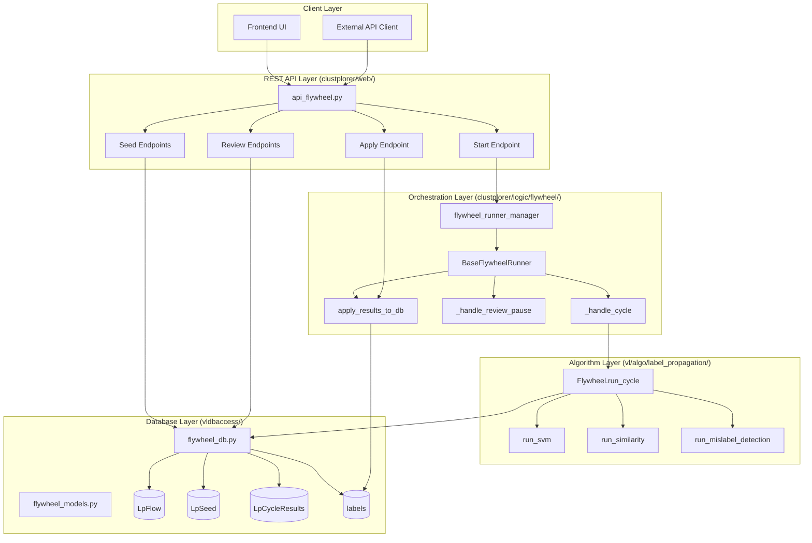
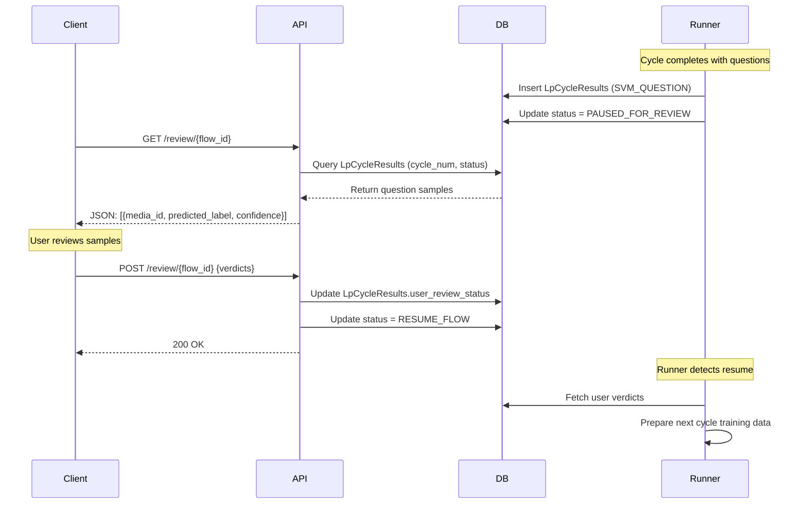
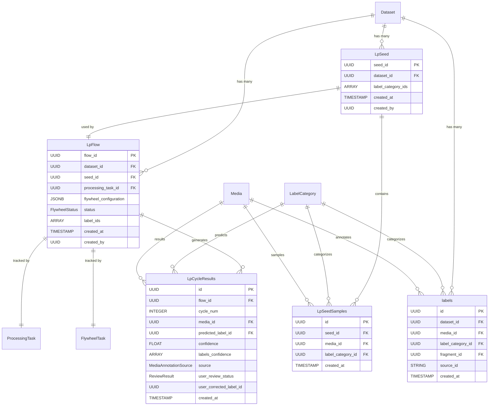
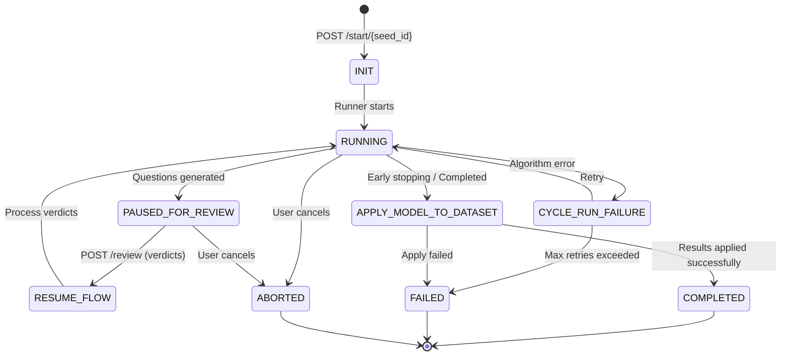
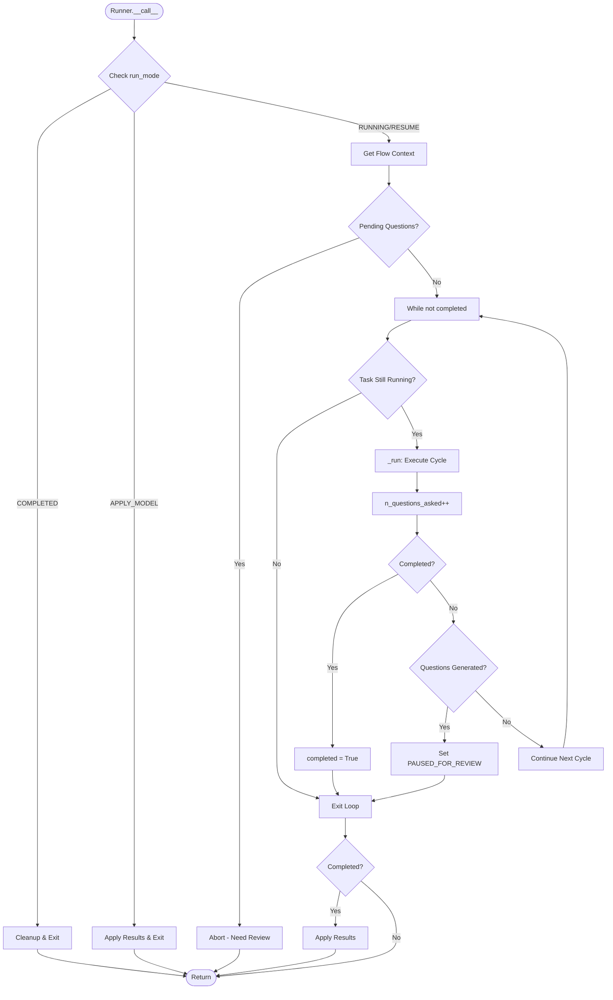
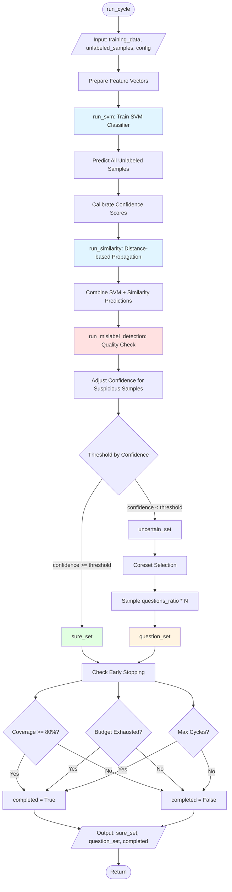
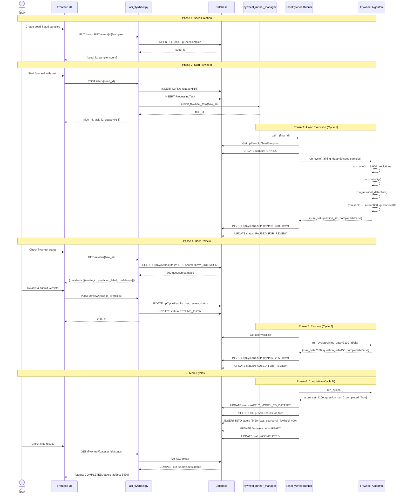
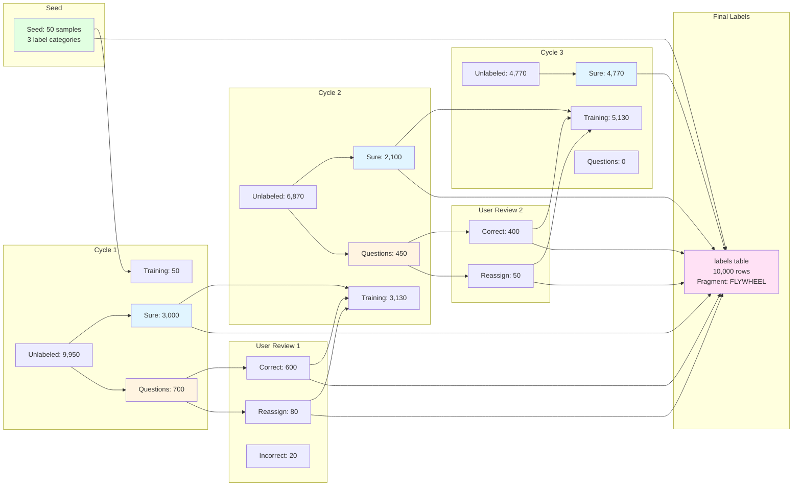

# Plan: In-Depth Learning of Visual Layer Flywheel Client

**TL;DR**: This expanded plan breaks down the 7-step learning path into granular sub-steps with specific code locations, key patterns to recognize, and targeted questions to guide your reading. You'll progress from API contracts → orchestration logic → algorithm internals, with checkpoints at each stage to verify understanding through code tracing.

---

## **System Architecture Overview**



---

## **Phase 1: REST API Layer & Client Contracts**

**Objective**: Understand how clients (UI, Camtek systems) trigger the flywheel and what data shapes are exchanged.

### **1.1 Seeding API Endpoints**

- **File**: `clustplorer/web/api_flywheel.py`
- **Read**: Lines 1–100 (imports, route definitions, decorator patterns)

**Questions to answer**:
  - What Flask blueprint is used for routing? Look for `@router.route()` decorators (FastAPI)  
  - What are the URL path patterns for seeding? (`/seed`, `/seed/{seed_id}`, `/seed/{seed_id}/label_category_id`, `/seed/{seed_id}/{label_id}/{media_id}`)
  - What HTTP methods correspond to create vs. update vs. delete? (PUT vs POST vs DELETE)

**Code Example - Seed Creation Endpoint**:
```python
# From clustplorer/web/api_flywheel.py
@router.put("/api/v1/flywheel/{dataset_id}/seed", tags=["flywheel"])
async def create_lp_seed(
    request: Request,
    response: Response,
    dataset_id: UUID,
    user: Annotated[User, Security(get_authorized_user, use_cache=False)],
    _: Annotated[None, Depends(check_operation_permission("flywheel_seed"))],
):
    return await LpSeed.create_(dataset_id, user.user_id)

@router.put("/api/v1/flywheel/{dataset_id}/seed/{seed_id}/label_category_id", tags=["flywheel"])
async def add_class_to_seed(
    request: Request,
    response: Response,
    dataset_id: UUID,
    seed_id: UUID,
    user: Annotated[User, Security(get_authorized_user, use_cache=False)],
    label_category_ids: Annotated[list[UUID], Body(embed=True)] = None,
):
    return await flywheel_db.add_label_class_to_seed(dataset_id, seed_id, label_category_ids)

@router.put(
    "/api/v1/flywheel/{dataset_id}/seed/{seed_id}/{label_category_id}/{media_id}",
    tags=["flywheel"],
)
async def add_sample_to_lp_seed(
    request: Request,
    response: Response,
    dataset_id: UUID,
    label_category_id: UUID,
    seed_id: UUID,
    media_id: UUID,
    user: Annotated[User, Security(get_authorized_user, use_cache=False)],
) -> SeedResponse:
    await LpSeedSamples.create_(dataset_id, seed_id, label_category_id, [media_id])
    return await flywheel_db.get_seed(dataset_id, seed_id)
```

**Key patterns to recognize**:
  - Endpoint signatures: `put('/flywheel/{dataset_id}/seed')` → creates empty seed
  - Request body validation: Look for `request.get_json()`, data validation before DB ops
  - Response shapes: What does a successful seed creation return? (seed_id, metadata?)
  - Error handling: How are validation failures handled? (HTTP 400, 409?)

**Checkpoint 1.1**: Manually trace the seed creation flow:
- Identify the function that handles `PUT /flywheel/{dataset_id}/seed`
- What does it call? Does it invoke `vldbaccess` functions?
- What data gets persisted to `LpSeed` table?

---

### **1.2 Seeding Constraints & Validation**

- **File**: `clustplorer/web/api_flywheel.py` (same file)
- **Read**: Search for validation logic in seed endpoints (look for error messages like "FLYWHEEL_REQUIRED_SEED_SAMPLES_PER_LABEL")

**Questions to answer**:
  - What are the minimum seed requirements? (Samples per label? Min label count?)
  - Where is this validation enforced? (API layer or DB layer?)
  - What happens if someone tries to start a flywheel with insufficient seed data?

**Key patterns to recognize**:
  - Constants defining minimums: `FLYWHEEL_REQUIRED_SEED_SAMPLES_PER_LABEL`, `FLYWHEEL_MAX_LABELS`
  - Pre-flight checks before `start_flywheel_run()`: These catch invalid configurations early
  - Error responses: Look for specific error codes that clients need to handle

**Checkpoint 1.2**: List all seed constraints:
- Write down 3–5 validation rules discovered
- Understand the business logic behind each (e.g., why ≥2 label categories?)

---

### **1.3 Flywheel Start & Execution API**

- **File**: `clustplorer/web/api_flywheel.py`
- **Read**: Locate the endpoint `POST /flywheel/{dataset_id}/start/{seed_id}`

**Questions to answer**:
  - What parameters does the client pass? (config, budget, early stopping criteria?)
  - What database objects are created? (LpFlow, ProcessingTask, FlywheelTask?)
  - Is the execution synchronous or asynchronous? (Is a task submitted to a queue?)
  - What does the API return to the client? (task_id, flow_id, initial status?)

**Key patterns to recognize**:
  - Task submission pattern: `start_flywheel_run()` → returns task metadata
  - Async orchestration: Look for calls to `flywheel_runner_manager.submit_flywheel_task()`
  - Status endpoint: Clients likely poll `GET /flywheel/task/{task_id}/status`

**Checkpoint 1.3**: Trace the start flow:
- Follow `POST /flywheel/{dataset_id}/start/{seed_id}` from endpoint → `start_flywheel_run()` → task submission
- Identify what task_id, flow_id are returned to the client
- Understand the initial state transition (INIT → RUNNING or INIT → PAUSED?)

---

### **1.4 Review & User Feedback API**

- **File**: `clustplorer/web/api_flywheel.py`
- **Read**: Locate endpoints `GET /flywheel/{dataset_id}/review/{flow_id}` and `POST /flywheel/{dataset_id}/review/{flow_id}`

**Questions to answer**:
  - What does the GET endpoint return? (question samples, grouped by predicted label? uncertainty scores?)
  - What format does the user submit feedback? (JSON with verdicts: CORRECT, INCORRECT, REASSIGN, IGNORE?)
  - How are verdicts stored? (Back to `LpCycleResults`?)
  - Does the API resume the cycle automatically, or does the client need to call another endpoint?

**Key patterns to recognize**:
  - Grouping strategy for questions: Are uncertain samples grouped by predicted label for easier review?
  - Verdict types: `CycleResultReviewStatus` enum (CORRECT, INCORRECT, REASSIGN, IGNORE)
  - Callback/resume mechanism: After POST review, does algorithm automatically resume?

**Checkpoint 1.4**: Understand the review loop:
- Write a mock JSON for a GET `/flywheel/{dataset_id}/review/{flow_id}` response
- Write a mock JSON for a POST review with, e.g., 10 samples and varied verdicts
- Predict: After POST, what state transitions occur?

**Review API Flow Diagram**:


**Mock Review Response**:
```json
{
  "flow_id": "123e4567-e89b-12d3-a456-426614174000",
  "cycle_num": 1,
  "question_groups": [
    {
      "predicted_label_id": "label-A-uuid",
      "predicted_label": "Defect Type A",
      "samples": [
        {
          "media_id": "media-001",
          "confidence": 0.73,
          "image_uri": "s3://bucket/image001.jpg",
          "confidence_by_label": [
            {"label": "Defect A", "confidence": 0.73},
            {"label": "Defect B", "confidence": 0.22},
            {"label": "Good", "confidence": 0.05}
          ]
        }
      ]
    }
  ]
}
```

**Mock Review Submission**:
```json
{
  "verdicts": [
    {"media_id": "media-001", "result": "CORRECT"},
    {"media_id": "media-002", "result": "INCORRECT"},
    {"media_id": "media-003", "result": "REASSIGN", "corrected_label_id": "label-B-uuid"},
    {"media_id": "media-004", "result": "IGNORE"}
  ]
}
```

---

### **1.5 Apply Results & Finalization API**

- **File**: `clustplorer/web/api_flywheel.py`
- **Read**: Locate endpoint `PUT /flywheel/apply/{flow_id}`

**Questions to answer**:
  - What triggers finalization? (Does the algorithm signal completion, or does the client?)
  - What gets persisted to the `labels` table? (Label, media_id, source metadata?)
  - What's the dataset status after apply? (ENRICHED, READY?)
  - Are there rollback mechanisms if apply fails?

**Key patterns to recognize**:
  - Snapshot creation: `FragmentType.FLYWHEEL` — what does this mean?
  - Bulk insert: All cycle results → labels table in one transaction
  - Metadata enrichment: Dataset status, enrichment tracking

**Checkpoint 1.5**: Understand finalization:
- What SQL operations happen in `apply_results_to_db()`?
- How many rows are inserted into `labels` table for a typical flywheel?

---

**End of Phase 1 Checkpoint**: Write pseudocode for a client library that:
1. Creates a seed
2. Starts a flywheel
3. Polls for cycle completion
4. Fetches review questions
5. Submits verdicts
6. Applies results

---

## **Phase 2: Database Layer & Data Modeling**

**Objective**: Understand how data flows through the database and what the actual table structures are.

### **2.1 Core Flywheel Tables**

- **Files**: 
  - `vldbaccess/models/flywheel_models.py` — ORM models
  - `vldbaccess/flywheel_db.py` — CRUD operations
  
- **Read**: `flywheel_models.py` for table definitions

**Questions to answer**:
  - What columns does `LpFlow` have? (dataset_id, seed_id, config_json?, status?)
  - What columns does `LpSeed` have? (seed_id, label_category_ids?, created_by?, created_at?)
  - What does `LpSeedSamples` store? (seed_id, media_id, label_id, is_confirmed?)
  - What's the schema of `LpCycleResults`? (flow_id, cycle_num, media_id, predicted_label, confidence_score, source, user_review_status?)

**Key patterns to recognize**:
  - Auditing columns: created_at, updated_at, created_by
  - JSON columns: config_json for algorithm parameters, result_json for cycle outputs
  - Relationship design: Foreign keys, indexes for fast lookups
  - Enums: Label sources (SEED, SVM_SURE, SVM_QUESTION, SIMILARITY, etc.), review statuses

**Checkpoint 2.1**: Draw an ER diagram:
- Tables: LpFlow, LpSeed, LpSeedSamples, LpCycleResults, FlywheelTask, labels
- Relationships: Foreign keys, cardinality (1-to-many, many-to-many)
- Note: Which queries would need to join multiple tables?

**Database Schema (ER Diagram)**:


**Key Table Definitions**:
```python
# From vldbaccess/models/flywheel_models.py
class FlywheelStatus(enum.Enum):
    INIT = "INIT"
    RUNNING = "RUNNING"
    PAUSED_FOR_REVIEW = "PAUSED_FOR_REVIEW"
    RESUME_FLOW = "RESUME_FLOW"
    CYCLE_RUN_FAILURE = "CYCLE_RUN_FAILURE"
    APPLY_MODEL_TO_DATASET = "APPLY_MODEL_TO_DATASET"
    FAILED = "FAILED"
    ABORTED = "ABORTED"
    COMPLETED = "COMPLETED"

class ReviewResult(enum.Enum):
    CORRECT = "CORRECT"      # User confirms prediction
    IGNORE = "IGNORE"        # User excludes from flow
    INFERRED = "INFERRED"    # High-confidence auto-label
    INCORRECT = "INCORRECT"  # User rejects prediction
    REASSIGN = "REASSIGN"    # User provides different label
    REVERT = "REVERT"        # User reverts previous verdict

class MediaAnnotationSource(str, enum.Enum):
    SEED = "SEED"
    REVIEW = "REVIEW"
    MODEL_INFERENCE = "MODEL_INFERENCE"
```

---

### **2.2 Lifecycle of a Sample Through Tables**

- **File**: `vldbaccess/flywheel_db.py`
- **Read**: Entire file; search for functions: `start_flywheel_run()`, `get_cycle_results()`, `apply_results_to_db()`

**Questions to answer**:
  - When a flywheel starts, how are seed samples inserted into `LpCycleResults`? (What source value?)
  - When algorithm runs, where are new predictions written? (New rows in `LpCycleResults` with cycle_num incremented?)
  - When user reviews, how are verdicts recorded? (Update `user_review_status` field?)
  - When finalizing, how do results flow from `LpCycleResults` → `labels` table?

**Key patterns to recognize**:
  - Data immutability: Each cycle creates new rows, not overwriting
  - Audit trails: Multiple rows per media_id with different cycle_num values
  - Transactional writes: Ensure consistency (all-or-nothing commits)

**Checkpoint 2.2**: Trace a single media item:
- Start: User adds it to seed with label_id=1
- Cycle 1: Algorithm predicts label_id=2 with confidence=0.85
- Review: User says CORRECT (verdicts says label_id=2 is right)
- Apply: Label inserted into `labels` table with label_id=2, source='vl_flywheel_v00'
- Write SQL-like pseudocode for each step

---

### **2.3 Configuration & State Persistence**

- **File**: `vldbaccess/flywheel_db.py`
- **Read**: Look for how `LpFlow.config_json` is used; search for references to `flywheel_configuration`

**Questions to answer**:
  - What configuration keys are stored in `LpFlow.config_json`? (questions_ratio, early_stopping_condition?)
  - Is config mutable after flywheel starts? (Or frozen snapshot?)
  - How are task status transitions tracked? (FlywheelTask status field?)
  - What metadata helps resume interrupted flywheels? (Last completed cycle_num?)

**Key patterns to recognize**:
  - Config as JSON: Allows flexible algorithm parameters
  - State machines: Task progresses through discrete states (INIT, RUNNING, PAUSED_FOR_REVIEW, etc.)
  - Resumption logic: If a flywheel crashes, can it restart from last checkpointed cycle?

**Checkpoint 2.3**:
- List 5 configuration parameters stored in `config_json`
- Draw the state diagram for FlywheelTask (states and transitions)

**Flywheel State Machine**:


**Configuration Parameters** (from `vl/algo/label_propagation/flywheel_configuration.py`):
```python
class BaseFlywheelConfiguration(BaseModel):
    # Mislabel Detection
    mislabel_mislabel_ratio: float = 0.2
    mislabel_sure_ratio: float = 0.2
    mislabel_sure_threshold: float = 0.03
    
    # Question Selection
    questions_ratio: float = 0.1              # 10% of dataset per cycle
    min_question_ratio: float = 0.05          # Minimum 5%
    
    # Early Stopping
    early_stopping_condition_media: int = 20
    early_stopping_condition_cycles: int = 2
    early_stopping_condition_prediction_rate: float = 0.8  # Stop when 80% confident
    
    # Active Learning
    select_per_iteration: int = 15
    max_iterations: int = 1000
    
    # Budget Control
    q_budget: int | None = None               # Total questions budget
    q_min_budget: int | None = None           # Minimum before early stop
    q_step: int | None = None                 # Questions per step
```

---

**End of Phase 2 Checkpoint**: Write a utility function:
```python
def get_sample_journey(flow_id, media_id):
    # Return all historical rows for media_id in this flow
    # Including: seed entry, cycle 1 prediction, user verdict, final label
    # Output: list of (cycle_num, predicted_label, confidence, source, user_review_status)
```

---

## **Phase 3: Orchestration Layer & Task Management**

**Objective**: Understand how the system coordinates execution, handles pauses, resumes, and manages task state.

### **3.1 BaseFlywheelRunner: Execution Loop**

- **File**: `clustplorer/logic/flywheel/base_flywheel_runner.py`
- **Read**: Lines 1–50 (class definition, constructor); then `run()` method

**Questions to answer**:
  - What are the constructor parameters? (flow_id, dataset_id, config, DB connection?)
  - What does the `run()` method do? (Main execution loop — does it call other methods in sequence?)
  - What's the high-level loop structure? (`while not completed: ...` logic?)
  - When does the loop pause? (Condition for PAUSED_FOR_REVIEW state?)

**Key patterns to recognize**:
  - State mutation: Does the runner update `LpFlow.status` directly, or via callbacks?
  - Cycle abstraction: Each iteration of the loop is a "cycle" (cycle_num incremented)
  - Exit conditions: `completed` flag set when budget exhausted, coverage reached, or quality checks pass
  - Error handling: How are exceptions caught? Is there a "FAILED" state?

**Checkpoint 3.1**: Pseudocode the `run()` method:

**Actual Code from BaseFlywheelRunner.__call__()**:
```python
# From clustplorer/logic/flywheel/base_flywheel_runner.py
def __call__(
    self,
    pre_cycle_handler=None,
    cycle_result_handler=None,
):
    logger.info("Gather flywheel run context")
    flow = self._get_flow()
    processing_task_id = flow.processing_task_id
    self.user_id = flow.created_by

    if self.run_mode == FlywheelStatus.COMPLETED:
        logger.info("Flywheel run in completed state close the flow")
        self._cleanup()
        return None
    elif self.run_mode == FlywheelStatus.APPLY_MODEL_TO_DATASET:
        logger.info("Applying currently annotated media to dataset")
        self._apply_results(processing_task_id)
        return None
    else:
        context = self._get_context(flow.label_ids)
        completed = False
        n_questions_asked, pending_questions = asyncio.run(
            flywheel_db.get_questions_stats(self.flow_id)
        )
        
        if pending_questions:
            logger.error("Pending questions for review: %s, abort flow", pending_questions)
            return

        while not completed:
            processing_task = asyncio.run(
                ProcessingTasksDAO.get_processing_task_status(processing_task_id, flow.created_by)
            )
            if processing_task.status in {
                ProcessingTaskStatus.COMPLETED,
                ProcessingTaskStatus.REJECTED,
            }:
                logger.info(
                    "Task not in running state %s %s", 
                    processing_task.status, 
                    processing_task.result_message
                )
                break
                
            # Run one cycle
            sure_set, question_set, completed = self._run(
                context=context,
                processing_task_id=processing_task_id,
                pre_cycle_handler=pre_cycle_handler,
                cycle_result_handler=cycle_result_handler,
                n_questions_asked=n_questions_asked,
                flywheel_configuration=flow.flywheel_configuration,
            )
            
            n_questions_asked += len(list(itertools.chain(*question_set.values())))
            
            if completed:
                logger.info("Flywheel last cycle was returned Completed Flag")
                break
            elif any(question_set.values()):
                logger.info(
                    "Flywheel last cycle returned %s questions altering state to PAUSED_FOR_REVIEW",
                    len(question_set.values()),
                )
                # Pause for user review
                asyncio.run(
                    ProcessingTasksDAO.update_processing_task_status(
                        processing_task_id,
                        status=ProcessingTaskStatus.IN_PROGRESS,
                        result_message=str(FlywheelStatus.PAUSED_FOR_REVIEW),
                    )
                )
                task_status = FlywheelTask.STATUS_MAPPING.get(
                    FlywheelStatus.PAUSED_FOR_REVIEW, TaskStatus.RUNNING
                )
                asyncio.run(
                    FlywheelTaskService.update_task_by_reference_id(
                        reference_id=processing_task_id,
                        status=task_status,
                        status_message="Waiting for user review",
                    )
                )
                break
            else:
                # Continue to another cycle
                logger.info("Cycle results ended without questions, continue to an another cycle")
                
        if completed:
            self._apply_results(processing_task_id)
```

**Execution Flow Diagram**:


---

### **3.2 Cycle Handling: SVM + Similarity**

- **File**: `clustplorer/logic/flywheel/base_flywheel_runner.py`
- **Read**: `_handle_cycle()` method; search for calls to algorithm functions

**Questions to answer**:
  - What inputs does `_handle_cycle()` prepare? (Previous cycle results, labeled samples, ignored items?)
  - What does it call? (Some function from `vl/algo/label_propagation/`?)
  - What are the outputs? (sure_set, question_set, completed flag, predictions with confidence scores?)
  - How is confidence thresholding done? (Sure if confidence > threshold? Use `mislabel_sure_threshold`?)

**Key patterns to recognize**:
  - Input assembly: Gather all prior labels (seed + previous cycles) as training data
  - Algorithm call: Likely calls something like `flywheel.run_cycle(training_data, unlabeled_samples, config)`
  - Filtering: sure_set = predictions with high confidence; question_set = uncertain
  - Bookkeeping: Store results in `LpCycleResults` with source={SVM_SURE, SVM_QUESTION, SIMILARITY, etc.}

**Checkpoint 3.2**: Trace the data flow:
- What's the shape of `sure_set` returned? (list of {media_id, predicted_label, confidence, source}?)
- What's the shape of `question_set`? (Same, but confidence < threshold?)

---

### **3.3 Review Pause Handling**

- **File**: `clustplorer/logic/flywheel/base_flywheel_runner.py`
- **Read**: `_handle_review_pause()` method

**Questions to answer**:
  - What happens when questions are identified? (Set task status to PAUSED_FOR_REVIEW?)
  - How does the loop pause? (Does `run()` return? Or busy-wait?)
  - When does it resume? (Is there a separate Resume API endpoint, or async callback when user submits verdicts?)
  - How are user verdicts fetched? (Query from `LpCycleResults.user_review_status`?)

**Key patterns to recognize**:
  - Pause mechanism: Task state → PAUSED_FOR_REVIEW; runner method returns control
  - Resumption trigger: Separate thread/process calls a "resume" function when verdicts available
  - Verdict incorporation: Next cycle uses user-labeled samples as part of training data

**Checkpoint 3.3**: Understand the pause-resume flow:
- Draw a timeline: Cycle N generates questions → Pause → User submits verdicts (via POST API) → Cycle N+1 starts automatically?
- Or: Pause → User submits verdicts → Client calls Resume API → Cycle N+1 starts?

---

### **3.4 Result Application & Finalization**

- **File**: `clustplorer/logic/flywheel/base_flywheel_runner.py`
- **Read**: `apply_results_to_db()` method

**Questions to answer**:
  - When is this called? (When `completed=True` after a cycle?)
  - What does it do? (Bulk insert from `LpCycleResults` → `labels` table?)
  - What metadata gets attached? (source=vl_flywheel_v00, timestamp, flow_id?)
  - Are there any transformation steps? (E.g., filter by user verdict = CORRECT?)
  - What happens to dataset status? (ENRICHED, READY?)

**Key patterns to recognize**:
  - Snapshot concept: `FragmentType.FLYWHEEL` — a immutable snapshot of results
  - Filtering: Only CORRECT verdicts? Or all except IGNORE?
  - Bulk operations: Single transaction for all inserts
  - Atomic transition: Update dataset status only if insert succeeds

**Checkpoint 3.4**: Write pseudocode for `apply_results_to_db()`:
```python
def apply_results_to_db(self):
    # 1. Fetch all final results from LpCycleResults
    results = get_final_results(flow_id)
    
    # 2. Filter by user verdicts (CORRECT, REASSIGN, etc.)
    
    # 3. Create snapshot, insert into labels table
    
    # 4. Update dataset status
    
    # 5. Mark task as COMPLETED
```

---

### **3.5 Task Submission & Manager Pattern**

- **File**: `clustplorer/logic/flywheel/flywheel_runner_manager.py`
- **Read**: Entire file; understand how tasks are submitted and executed

**Questions to answer**:
  - How is a flywheel task submitted? (Passed to a job queue, or started as a thread?)
  - What are the execution backends? (Local, Argo K8s, Ray?)
  - How is progress tracked? (Polling? Callbacks? Event streams?)
  - How are errors reported back to clients? (Task status = FAILED; error message logged?)

**Key patterns to recognize**:
  - Strategy pattern: Different backends (Local, Argo, Ray) implement the same submit interface
  - Async execution: `submit()` returns immediately; runner executes in background
  - Status polling: API clients call `GET /task/{task_id}/status` to check progress

**Checkpoint 3.5**:
- Identify: What's the default execution backend? (Likely Argo in production?)
- What does the task queue store? (Task ID, status, logs, error messages?)

---

**End of Phase 3 Checkpoint**: Trace a complete execution flow with task state diagram:
- Client calls `POST /flywheel/start/{seed_id}` → Task INIT
- Runner starts → Task RUNNING
- Cycle generates questions → Task PAUSED_FOR_REVIEW
- User submits verdicts → Task RESUMED
- ... (more cycles) ...
- Completed → Task APPLY_MODEL_TO_DATASET
- Results applied → Task COMPLETED

---

## **Phase 4: Algorithm Layer — Label Propagation**

**Objective**: Deep dive into the core ML algorithms: SVM classification, similarity-based propagation, mislabel detection, and quality control.

### **4.1 Flywheel Configuration & Hyperparameters**

- **File**: `vl/algo/label_propagation/flywheel_configuration.py`
- **Read**: Entire file

**Questions to answer**:
  - What's the default `questions_ratio`? (10% means ask user to label 10% of dataset per cycle?)
  - What's `early_stopping_condition_prediction_rate`? (Stop if 80% of dataset has confident predictions?)
  - What's `select_per_iteration`? (SVM selects 15 samples per active learning step?)
  - What's `mislabel_sure_threshold`? (Confidence score for mislabel detection — default 3% error tolerance?)
  - How are budgets enforced? (Max cycles, max questions asked in total?)

**Key patterns to recognize**:
  - Configuration as a dataclass or config object: Easy to serialize/deserialize
  - Hyperparameter tuning: Business rules (e.g., "don't label > 30% of dataset") vs. ML heuristics
  - Early stopping: Multiple conditions trigger completion (budget, coverage, quality)

**Checkpoint 4.1**: Create a configuration profile:
- For a dataset with 10,000 samples and user time budget = 500 labels:
  - How many cycles before budget exhausted?
  - How many questions per cycle (using `questions_ratio`)?
  - Estimate total user effort

---

### **4.2 Core Algorithm: run_cycle()**

- **File**: `vl/algo/label_propagation/flywheel.py`
- **Read**: `run_cycle()` method (likely 50–100 lines); understand the high-level flow

**Questions to answer**:
  - What are the input parameters? (training_data, unlabeled_samples, config, previous_predictions?)
  - What's the output? (sure_set, question_set, completed flag, all predictions?)
  - What are the main steps? (1. SVM train, 2. Predict all, 3. Similarity propagate, 4. Mislabel detect, 5. Threshold/filter)
  - How are ignored items handled? (Excluded from active learning?)

**Key patterns to recognize**:
  - Pipeline abstraction: Steps executed sequentially, each consuming prior outputs
  - Result aggregation: Combine predictions from multiple models (SVM + similarity)
  - Filtering: Thresholding and filtering to separate sure/question sets

**Checkpoint 4.2**: Draw the algorithm flowchart:

**Algorithm Flow Diagram**:


**Pseudocode**:
```
Inputs:
  - training_data (seed + previous cycles)
  - unlabeled_samples
  - config (questions_ratio, thresholds, etc.)

Steps:
  1. run_svm() → [all predictions with confidence]
  2. run_similarity() → [similarity-based propagation]
  3. run_mislabel_detection() → [confidence adjustment]
  4. Filter by threshold → [sure_set, question_set]
  5. Coreset selection (sample questions) → [limited question set]

Outputs:
  - sure_set, question_set, completed flag
```

---

### **4.3 SVM-Based Active Learning: run_svm()**

- **File**: `vl/algo/label_propagation/flywheel.py`
- **Read**: `run_svm()` method

**Questions to answer**:
  - What SVM implementation is used? (sklearn? scikit-multilearn?)
  - How is class imbalance handled? (Over/under-sampling? Class weights?)
  - What's the active learning strategy? (Uncertainty sampling? Margin sampling?)
  - How is the SVM calibrated? (Platt scaling? Isotonic regression?)
  - What does it return? (Predictions + confidence scores for each class?)

**Key patterns to recognize**:
  - Binary vs. multi-class: Are there multiple binary SVMs (one-vs-rest) or a true multi-class approach?
  - Calibration: Confidence scores must be well-calibrated probabilities (not raw decision function values)
  - Iterative refinement: Does active learning loop? (e.g., select uncertain samples, retrain, repeat?)

**Checkpoint 4.3**: Understanding SVM confidence:
- For a 3-class problem (A, B, C), what does SVM output? (3 confidence scores summing to 1.0?)
- How is confidence used to define sure vs. question? (If top 2 classes are close, mark as uncertain?)

---

### **4.4 Similarity-Based Propagation: run_similarity()**

- **File**: `vl/algo/label_propagation/flywheel.py`
- **Read**: `run_similarity()` method

**Questions to answer**:
  - What distance metric is used? (Euclidean? Cosine? Learned metric?)
  - How is the similarity matrix computed? (Pairwise distances between all samples?)
  - How are propagation weights computed? (K-nearest neighbors? Kernel weighting?)
  - Does it override SVM predictions, or combine with them?
  - What's the computational complexity? (O(n²) for n samples — scalable?)

**Key patterns to recognize**:
  - Lazy propagation: Can it be computed on-demand for only question samples?
  - Weighting: Nearby labeled samples contribute more to unlabeled sample labels
  - Semi-supervised logic: Leverage unlabeled data structure

**Checkpoint 4.4**: Understand propagation with an example:
- Suppose media_id=100 is unlabeled, and nearest neighbors are:
  - media_id=1 (label=A, distance=0.1)
  - media_id=2 (label=B, distance=0.3)
  - media_id=3 (label=B, distance=0.5)
- Compute propagation confidence for A, B, C with inverse-distance weighting

---

### **4.5 Mislabel Detection & Quality Control: run_mislabel_detection()**

- **File**: `vl/algo/label_propagation/flywheel.py`
- **Read**: `run_mislabel_detection()` method

**Questions to answer**:
  - What's a mislabel? (A prediction inconsistent with nearby labeled samples?)
  - How are mislabels detected? (Distance to nearest labeled sample > threshold? Confidence drop?)
  - What happens to detected mislabels? (Mark as uncertain/question instead of sure?)
  - Is this feedback to user review? (Force human verification of suspicious samples?)

**Key patterns to recognize**:
  - Uncertainty propagation: Mislabel detection increases question_set size
  - Quality assurance: Prevents system from propagating incorrect labels
  - Threshold tuning: `mislabel_sure_threshold` controls sensitivity

**Checkpoint 4.5**:
- Describe a scenario where mislabel detection prevents error propagation (e.g., SVM predicts A with 0.9 confidence, but all neighbors are B)

---

### **4.6 Coreset Selection & Active Learning Sampling**

- **File**: `vl/algo/label_propagation/coreset.py`
- **Read**: Entire file (if it exists and is relevant)

**Questions to answer**:
  - What's a coreset? (Minimal representative sample for efficient learning?)
  - How are question samples selected? (Random? Uncertainty-biased? Diversity-biased?)
  - How does `questions_ratio` control selection? (Select top N% most uncertain?)
  - Are there batch effects? (Is diversity considered, or just uncertainty ranking?)

**Key patterns to recognize**:
  - Active learning heuristic: Sample uncertain, boundary-crossing predictions
  - Diversity: Avoid clustering questions in one area of feature space
  - Budget-aware: Select exactly `questions_ratio * dataset_size` samples

**Checkpoint 4.6**: Design a coreset selection strategy:
- Given 10,000 unlabeled samples and questions_ratio=0.1 (1,000 questions):
- How many samples would be selected from the "uncertain" region (0.4–0.6 confidence)?
- How many from "low uncertainty but boundary-crossing" region?

---

**End of Phase 4 Checkpoint**: Implement pseudocode for `run_cycle()`:
```python
def run_cycle(self, training_data, unlabeled_samples, config, previous_results):
    # Step 1: Train SVM, predict all
    svm_predictions = self.run_svm(training_data, unlabeled_samples)
    
    # Step 2: Propagate via similarity
    sim_predictions = self.run_similarity(training_data, unlabeled_samples)
    
    # Step 3: Detect mislabels
    safe_predictions = self.run_mislabel_detection(svm_predictions, sim_predictions)
    
    # Step 4: Threshold by confidence
    sure_set = [p for p in safe_predictions if p.confidence > config.sure_threshold]
    uncertain_set = [p for p in safe_predictions if p.confidence <= config.sure_threshold]
    
    # Step 5: Coreset selection
    question_set = self.select_questions(uncertain_set, config.questions_ratio)
    
    # Step 6: Check completion
    completed = check_early_stopping(sure_set, config)
    
    return sure_set, question_set, completed
```

---

## **Phase 5: Integration & Tracing End-to-End**

**Objective**: Connect all layers and trace a complete example from seed → multiple cycles → user review → finalization.

### **5.1 Manual Trace: Seed to First Cycle**

**Files to reference**:
  - `clustplorer/web/api_flywheel.py` — start endpoint
  - `vldbaccess/flywheel_db.py` — start_flywheel_run()
  - `clustplorer/logic/flywheel/base_flywheel_runner.py` — run() and _handle_cycle()
  - `vl/algo/label_propagation/flywheel.py` — run_cycle()

**Exercise**: Trace through the code as if you were executing this:

```
1. Client: POST /api/v1/flywheel/dataset-123/start/seed-456
   └─> [api_flywheel.py] Calls start_flywheel_run(dataset_id=123, seed_id=456, config={...})

2. [flywheel_db.py::start_flywheel_run]
   ├─ Create LpFlow record (dataset=123, seed=456, status=INIT)
   ├─ Load LpSeedSamples for seed-456 (e.g., 50 samples, 3 labels)
   ├─ Insert seed samples into LpCycleResults with cycle_num=0, source='SEED'
   └─ Return flow_id, task_id, status

3. Response: {flow_id: ..., task_id: ..., status: "INIT"}

4. [Async: BaseFlywheelRunner.run() starts in background]
   ├─ Fetch LpFlow, LpSeedSamples, dataset metadata
   ├─ cycle_num = 0 → 1
   ├─ Call _handle_cycle()
   │  └─ Prepare training_data = 50 seed samples
   │  └─ Prepare unlabeled_samples = 9,950 remaining samples
   │  └─ Call flywheel.run_cycle(training_data, unlabeled_samples, config)
   │     ├─ run_svm(): Train SVM on 50 seed samples, predict all 9,950
   │     ├─ run_similarity(): Propagate labels via similarity
   │     ├─ run_mislabel_detection(): Quality check
   │     ├─ Threshold: sure_set (e.g., 3,000 samples, confidence > 0.85)
   │     └─ question_set (e.g., 700 samples, confidence 0.5–0.85)
   │  └─ Insert sure_set into LpCycleResults with source='SVM_SURE'
   │  └─ Insert question_set into LpCycleResults with source='SVM_QUESTION'
   │  └─ Return sure_set, question_set, completed=False

5. [base_flywheel_runner.py] Check: Is question_set non-empty?
   ├─ Yes → Set FlywheelTask.status = PAUSED_FOR_REVIEW
   ├─ Return control, await user input

6. Client: GET /api/v1/flywheel/dataset-123/review/flow-789
   └─> [api_flywheel.py] Query LpCycleResults where cycle_num=1, source~'SVM_QUESTION'
       └─> Group by predicted_label, return (media_id, predicted_label, confidence, similar_labeled_samples_for_context)
```

**Questions to answer while tracing**:
- At step 2, how many rows are inserted into `LpCycleResults`? (50 seed samples)
- At step 4, how many total rows are inserted? (3,000 SVM_SURE + 700 SVM_QUESTION = 3,700)
- Total rows in table after cycle 1? (50 + 3,700 = 3,750)
- At step 6, what's the size of the review payload? (700 samples with metadata)

**Checkpoint 5.1**: Write the trace as a log:
```
[START] POST /flywheel/dataset-123/start/seed-456
[INIT] Created LpFlow id=flow-789, task_id=task-001, status=INIT
[ASYNC_START] Runner started for flow-789
[CYCLE_1_START] cycle_num=1
[CYCLE_1_SVM] SVM trained on 50 labels, predicted 9,950 samples
[CYCLE_1_THRESHOLD] sure_set=3000, question_set=700, completed=False
[CYCLE_1_RESULTS_SAVED] Inserted 3,700 rows into LpCycleResults
[CYCLE_1_END] status → PAUSED_FOR_REVIEW
[USER_WAIT] Waiting for verdict submission...
```

**Complete End-to-End Sequence Diagram**:


---

### **5.2 Manual Trace: User Review & Cycle Resumption**

**Files to reference**:
  - `clustplorer/web/api_flywheel.py` — review endpoints
  - `vldbaccess/flywheel_db.py` — verdict recording
  - `base_flywheel_runner.py` — _handle_review_pause()

**Exercise**: Trace user review and cycle resumption:

```
1. User sees 700 uncertain samples grouped by predicted label
   ├─ Label A: 250 samples, avg confidence 0.78
   ├─ Label B: 300 samples, avg confidence 0.72
   └─ Label C: 150 samples, avg confidence 0.65

2. User reviews and marks:
   ├─ Sample 1: CORRECT (predicted A, user agrees)
   ├─ Sample 2: INCORRECT (predicted A, user says B)
   ├─ Sample 3: REASSIGN (predicted A, user says C)
   ├─ Sample 4: IGNORE (unclear, skip)
   └─ ... (700 total)

3. Client: POST /api/v1/flywheel/dataset-123/review/flow-789
   └─> Payload: {verdicts: [{media_id, verdict, corrected_label if REASSIGN}, ...]}

4. [api_flywheel.py] Records verdicts:
   └─> For each verdict:
       └─> Update LpCycleResults.user_review_status = CORRECT/INCORRECT/REASSIGN/IGNORE
       └─> If REASSIGN, also set LpCycleResults.user_corrected_label

5. [base_flywheel_runner.py::_handle_review_pause]
   ├─ Fetch verdicts from DB
   ├─ Separate: correct_verdicts (600), incorrect_verdicts (50), reassign_verdicts (30), ignored (20)
   ├─ prepare_training_data_for_next_cycle():
   │  ├─ seed_samples (50, source=SEED)
   │  ├─ sure_labels_from_cycle_1 (3,000, source=SVM_SURE, confidence > 0.85)
   │  ├─ user_corrected_labels (30 + 50 = 80, source=USER_CORRECTED)
   │  └─ Total training data: 50 + 3,000 + 80 = 3,130 samples
   │
   └─ Resume: cycle_num = 1 → 2

6. Cycle 2 execution:
   ├─ Training data: 3,130 labels (more diverse, includes corrections)
   ├─ Unlabeled pool: 9,950 - 3,000 - 80 = 6,870 samples
   ├─ run_svm(): Train on 3,130, predict 6,870
   ├─ run_similarity(): Propagate
   ├─ run_mislabel_detection(): Quality check
   ├─ Threshold: sure_set=2,100, question_set=450, completed=False
   └─ Insert 2,550 rows into LpCycleResults (cycle_num=2)

7. Check: Question_set non-empty?
   ├─ Yes → status → PAUSED_FOR_REVIEW (Cycle 2)
   └─ Await next user review
```

**Questions to answer**:
- How did the training data improve from Cycle 1 to Cycle 2? (30x more, including user corrections)
- Why did question_set shrink from 700 to 450? (Better training data → higher confidence)
- How many total rows in `LpCycleResults` after Cycle 2? (50 seed + 3,700 cycle1 + 2,550 cycle2 = 6,300)
- What queries help retrieve verdicts efficiently? (Index on flow_id, cycle_num?)

**Checkpoint 5.2**: Extend the trace log:
```
[USER_REVIEW_START] 700 questions presented
[USER_VERDICTS] CORRECT=600, INCORRECT=50, REASSIGN=30, IGNORE=20
[VERDICTS_SAVED] Updated 700 rows in LpCycleResults with user_review_status
[CYCLE_2_START] cycle_num=2, training_data=3,130 labels
[CYCLE_2_SVM] SVM trained on 3,130 labels, predicted 6,870 samples
[CYCLE_2_THRESHOLD] sure_set=2100, question_set=450, completed=False
[CYCLE_2_RESULTS_SAVED] Inserted 2,550 rows into LpCycleResults
[CYCLE_2_END] status → PAUSED_FOR_REVIEW
```

---

### **5.3 Manual Trace: Finalization & Apply**

**Files to reference**:
  - `base_flywheel_runner.py` — apply_results_to_db()
  - `vldbaccess/flywheel_db.py` — bulk insert into labels table
  - `clustplorer/web/api_flywheel.py` — apply endpoint

**Exercise**: Trace finalization:

```
1. Suppose after Cycle 3, run_cycle() returns: sure_set=1,200, question_set=0, completed=True
   └─> completed=True triggers finalization

2. [base_flywheel_runner.py::apply_results_to_db]
   ├─ Query all LpCycleResults for flow_id=flow-789
   ├─ Separate by source & verdict:
   │  ├─ SEED samples (50): source='SEED'
   │  ├─ User-corrected samples (80): source='USER_CORRECTED'
   │  ├─ Auto-labeled sure samples (6,300): source='SVM_SURE'
   │  └─ Still unreviewed questions from Cycle 2 (if any): IGNORE
   │
   ├─ Create FragmentSnapshot (type=FLYWHEEL, flow_id=flow-789)
   │
   ├─ Bulk insert into labels table:
   │  For each final result:
   │  INSERT INTO labels (media_id, label_id, fragment_id, source, created_at)
   │  VALUES (123, 'LABEL_A', snap-001, 'vl_flywheel_v00', NOW())
   │  └─> ~6,430 inserts total (50+80+6,300)
   │
   ├─ Update LpFlow.status = APPLY_MODEL_TO_DATASET
   ├─ Update Dataset status = READY
   ├─ Update FlywheelTask.status = COMPLETED
   └─ Return result summary

3. Dataset now has 6,430 new labels from flywheel
   └─> Enriched with metadata: source_id='vl_flywheel_v00', fragment snapshot
```

**Questions to answer**:
- How many rows were inserted into `labels`? (6,430)
- What source value identifies flywheel labels? (vl_flywheel_v00)
- Are old labels overwritten, or do we have version history? (Snapshots via FragmentType)
- What queries help analyze flywheel impact? (COUNT labels by source)

**Checkpoint 5.3**: Draw the final summary:
```
Flow Summary:
  Dataset: dataset-123
  Seed: 50 samples (3 labels)
  Cycle 1: +3,700 results (sure: 3,000, questions: 700)
  Cycle 2: +2,550 results (sure: 2,100, questions: 450)
  Cycle 3: +600 results (sure: 600, questions: 0) → COMPLETED
  ─────────────────────────────────
  Total labels added: 6,430 (+ 50 original seed)
  Final dataset size: ~10,000 samples (assuming unlabeled before)
  User effort: ~1,150 labels (seed 50 + cycle1 700 + cycle2 450)
  Efficiency: ~7x (6,430 added vs. 900 user-provided)
```

---

**End of Phase 5 Checkpoint**: Create a system diagram with data quantities:

**Data Flow Through Cycles (Sankey-style)**:


**Tabular Summary**:
```
         Seed            Cycle 1            Cycle 2            Cycle 3
      (50 labels)    (Questions: 700)   (Questions: 450)     (Complete)
         │                │                  │                  │
         │                │                  │                  │
         ▼                ▼                  ▼                  ▼
Unlabeled: 9,950    Unlabeled: 9,950    Unlabeled: 6,870     Unlabeled: 0
           │              │                  │
           │ SVM train    │ SVM train       │ SVM train
           │              │                 │
           ▼              ▼                 ▼
      Sure: 3,000    Sure: 2,100       Sure: 1,200
      Ques: 700      Ques: 450         Ques: 0
           │              │                  │
           │              │                  │
         [User Review]  [User Review]   [COMPLETE]
           │              │                  │
           └──────────────┴──────────────────┘
                          │
                          ▼ Final Apply
                    [labels table]
                    6,430 new rows
                    Fragment snap-001
```

---

## **Phase 6: Advanced Topics & Customization**

**Objective**: Understand how to extend, customize, and optimize the system.

### **6.1 Custom Configuration & Budget Control**

- **File**: `vl/algo/label_propagation/flywheel_configuration.py`

**Questions to explore**:
  - How would you configure flywheels for high-budget scenarios (user can label 5% of dataset)?
  - How would you configure for low-budget (only 100 labels available)?
  - What's the impact of changing `early_stopping_condition_prediction_rate` from 0.8 to 0.95?
  - How do you disable early stopping (infinite cycles) vs. enforce hard cycle limit?

**Exploration**:
  - Create 3 configuration profiles (low-budget, medium, high-budget)
  - For a 100,000-sample dataset, estimate cycles and user effort for each
  - Reason about trade-offs (speed vs. coverage vs. quality)

---

### **6.2 Custom Feature Representations**

- **File**: `vl/algo/label_propagation/flywheel.py` (look for how features are extracted)

**Questions to explore**:
  - How are samples represented as feature vectors? (Embeddings from a model?)
  - Where does the feature extraction happen? (In `run_svm()`, `run_similarity()`?)
  - Can you swap the feature model? (E.g., use CLIP, ResNet, custom model?)
  - How does feature quality impact SVM and similarity propagation?

**Exploration**:
  - Find where feature vectors are loaded or computed
  - Design a custom feature extractor interface
  - Estimate impact of feature quality on algorithm performance

---

### **6.3 Custom Label Selection & Coreset Strategies**

- **File**: `vl/algo/label_propagation/coreset.py`

**Questions to explore**:
  - How are question samples currently selected? (Uncertainty? Diversity? Random?)
  - What's the impact of changing selection strategy?
  - Could you implement a custom coreset algorithm (e.g., k-center, influence functions)?
  - How would you trade off exploration (uncertain samples) vs. exploitation (confirming confident predictions)?

**Exploration**:
  - Design an alternative sampling strategy
  - Estimate computational cost vs. label efficiency gains
  - Create a benchmark comparing strategies

---

### **6.4 Integration with External Model Training**

- **Files**:
  - `providers/camtek/` — customer-specific integrations
  - `devops/clients/camtek/` — deployment config with API endpoints

**Questions to explore**:
  - How does Camtek integrate its model training service with Visual Layer?
  - What's the feedback loop? (Visual Layer → Camtek API → retrain model → better predictions?)
  - How are predictions from external models incorporated? (Do they override SVM predictions?)
  - What's the gRPC/REST API contract?

**Exploration**:
  - Design a custom integration for a different training service
  - Estimate performance improvement from external model predictions
  - Plan deployment architecture (service mesh, load balancing, etc.)

---

### **6.5 Monitoring, Logging, & Debugging**

- **Questions to explore**:
  - What metrics should you monitor? (Cycle duration, question volume, user agreement rate, final coverage?)
  - How would you debug a stuck flywheel? (Add logging, check task status, inspect DB states)
  - How would you analyze user verdict patterns? (Are certain label categories harder than others?)

**Exploration**:
  - Design a dashboard showing: cycles per day, user effort, label quality metrics
  - Create SQL queries to analyze: agreement rates, category-wise performance, prediction confidence distributions
  - Design debug checklist for troubleshooting common issues

---

**End of Phase 6**: Create an extension roadmap:
```
Priority 1 (Easy):
  - Custom FlywheelConfiguration profiles
  - Enhanced logging & metric collection
  
Priority 2 (Medium):
  - Custom feature extractors
  - Alternative coreset selection strategies
  
Priority 3 (Hard):
  - Integrate external model training loops
  - Implement distributed flywheel for 1M+ sample datasets
```

---

## **Phase 7: Testing & Verification**

**Objective**: Learn how to test the system and verify correctness.

### **7.1 Unit Testing the Algorithm**

**Files to explore**:
- `tests/test_api_flywheel_*.py` — existing test cases

**Questions to answer**:
  - How are unit tests structured? (Setup data → call function → assert output)
  - What does a typical test look like? (Mocked DB, test configuration, assertions on cycle results?)
  - How would you test `run_svm()`? (Synthetic training/test data with known labels)
  - How would you test `run_cycle()`? (End-to-end with controlled inputs, verify sure/question split)

**Exploration**:
  - Read 2–3 existing test files
  - Design 5 test cases for `run_cycle()`:
    - Perfect SVM (100% confidence) → sure_set contains all
    - Noisy SVM (50% confidence) → question_set = most samples
    - Mixed labels + similarity helps → verify propagation improves SVM alone
    - Early stopping triggered → verify completed=True
    - Budget exceeded → verify hard cycle limit
  - Write pseudocode for each test

---

### **7.2 End-to-End Testing**

**Questions to answer**:
  - How do you test the full flow (seed → cycles → apply)?
  - What test data do you need? (A real dataset? Synthetic?)
  - How do you verify correctness? (Inspect final labels? Check DB integrity?)
  - How long do E2E tests take? (Do they run on each commit, or nightly?)

**Exploration**:
  - Design an E2E test scenario:
    - Load a small dataset (1,000 samples, 3 labels, 30 pre-labeled seed)
    - Run flywheel with specific config (questions_ratio=0.1, 3 cycles max)
    - Verify: All cycles execute, verdicts recorded, final labels applied
    - Assertions: Final label count > seed count, no data loss, consistent state
  - Estimate test runtime

---

### **7.3 Performance & Load Testing**

**Questions to answer**:
  - How fast should a single cycle run? (For 100K samples? 1M samples?)
  - What's the bottleneck? (SVM training? Similarity matrix? DB inserts?)
  - How would you benchmark? (Profile each function, measure wall-clock time?)
  - What's the scalability limit? (Can it handle 10M samples? 100M?)

**Exploration**:
  - Design a load test with increasing dataset sizes: 1K, 10K, 100K, 1M
  - Measure: Cycle duration, memory usage, DB query latency
  - Identify: Which components scale linearly vs. quadratically
  - Propose: Optimizations (e.g., lazy similarity, approximate nearest neighbors, distributed SVM)

---

**End of Phase 7 Checkpoint**: Create a test plan document:
```markdown
# Flywheel Testing Strategy

## Unit Tests
- Algorithm components: run_svm, run_similarity, run_mislabel_detection
- Configuration validation
- Coreset selection

## Integration Tests
- Seed creation & validation
- Cycle execution with DB
- User review & verdict recording
- Result application & finalization

## End-to-End Tests
- Full flow: seed → cycles → apply
- Multiple review loops
- Early stopping scenarios
- Error handling & recovery

## Performance Tests
- Cycle duration vs. dataset size
- Memory consumption profile
- DB query performance
```

---

## **Phase 8: Putting It All Together**

**Objective**: Synthesize all learning into a holistic understanding and identify your own extension areas.

### **8.1 Architecture Diagram**

**Create a comprehensive system diagram showing**:
- Layers: API → Orchestration → Algorithm → DB
- Data flow: Seed → LpFlow → BaseFlywheelRunner → flywheel.py → LpCycleResults → labels
- State transitions: INIT → RUNNING → PAUSED_FOR_REVIEW → APPLY → COMPLETED
- Key files & their responsibilities

**Checkpoint**: Redraw the entire system from memory without looking at code

---

### **8.2 Decision Points & Tradeoffs**

**Document 5 key architectural decisions**:
1. Why is flywheel execution asynchronous? (Avoid blocking API calls for long-running cycles)
2. Why use LpCycleResults as an immutable log? (Audit trail, resumption support)
3. Why separate sure/question sets? (User focuses on uncertain cases)
4. Why combine SVM + similarity? (Hybrid strength: local vs. global structure)
5. Why use classification thresholds instead of fixed questions_ratio? (Adapt to data distribution)

---

### **8.3 Identify Your Extension Areas**

**Brainstorm 5 potential extensions**:
1. **Custom feature models**: Replace with domain-specific embeddings (medical, industrial, etc.)
2. **Multi-label classification**: Extend algorithm to handle samples with multiple labels
3. **Active learning strategies**: Implement Query-by-Committee, Expected Model Change, etc.
4. **Real-time feedback integration**: Incorporate user corrections mid-cycle (not just between cycles)
5. **Distributed execution**: Scale to 100M+ samples with cluster-based SVM & similarity

**For each extension**, answer:
- How would you modify the code? (Which files change?)
- What's the effort estimate? (Days? Weeks?)
- What's the expected impact? (Label efficiency? Speed? Scalability?)

---

### **8.4 Knowledge Checklist**

**Verify you can answer all of these**:

- [ ] Explain the complete flow from "client calls API" to "labels in database"
- [ ] Draw the ER diagram of flywheel DB tables from memory
- [ ] Describe the state machine (all 8 states, all transitions)
- [ ] Explain what SVM, similarity, and mislabel detection each contribute
- [ ] Calculate: For a 50K-sample dataset with seed=100, questions_ratio=0.05, how many cycles before completion?
- [ ] Trace the code path for `POST /flywheel/{dataset_id}/start/{seed_id}` → `flywheel_db.start_flywheel_run()` → `BaseFlywheelRunner.run()` → `flywheel.run_cycle()`
- [ ] Understand why user verdicts are incorporated as training data in the next cycle
- [ ] Explain how early stopping works (what conditions trigger completion?)
- [ ] Describe the difference between sure_set and question_set (what determines membership?)
- [ ] Design a custom configuration profile for your own use case

---

## **Summary: Phase Progression**

| Phase | Focus | Outcome |
|-------|-------|---------|
| 1 | REST API contracts | Understand how clients interact |
| 2 | Database & data models | Understand data flow & persistence |
| 3 | Orchestration & tasks | Understand execution coordination |
| 4 | Algorithm internals | Understand SVM, similarity, quality control |
| 5 | End-to-end tracing | Understand complete flows with quantities |
| 6 | Customization & extensions | Identify leverage points for modifications |
| 7 | Testing & verification | Understand how to validate correctness |
| 8 | Synthesis & reflection | Own the architecture, identify future work |

---

## **How to Use This Plan**

1. **Linear progression**: Work through phases 1–8 in order; each builds on prior phases
2. **Checkpoints as progress gates**: You understand phase N only after passing all checkpoints
3. **Code-first learning**: Always read code, not just understand conceptually
4. **Active exercises**: Design, trace, pseudocode — don't just passive reading
5. **Iteration**: If a phase seems unclear, re-read section + run example

**Estimated time**: 20–40 hours of focused study (varies by depth and prior ML experience)

---

## **Quick Reference: Key Code Locations**

| Component | File Path | Key Functions/Classes |
|-----------|-----------|----------------------|
| **REST API** | `clustplorer/web/api_flywheel.py` | `create_lp_seed`, `add_sample_to_lp_seed`, `start_flywheel`, `get_review`, `post_review` |
| **Orchestration** | `clustplorer/logic/flywheel/base_flywheel_runner.py` | `BaseFlywheelRunner.__call__`, `_run`, `_apply_results` |
| **Task Manager** | `clustplorer/logic/flywheel/flywheel_runner_manager.py` | `submit_flywheel_task`, `FlywheelRunnerManager` |
| **Algorithm Core** | `vl/algo/label_propagation/flywheel.py` | `Flywheel.run_cycle`, `run_svm`, `run_similarity`, `run_mislabel_detection` |
| **Configuration** | `vl/algo/label_propagation/flywheel_configuration.py` | `BaseFlywheelConfiguration`, `FlywheelConfiguration` |
| **Database ORM** | `vldbaccess/models/flywheel_models.py` | `FlywheelStatus`, `ReviewResult`, `MediaAnnotationSource` |
| **Database Ops** | `vldbaccess/flywheel_db.py` | `start_flywheel_run`, `apply_results_to_db`, `get_cycle_results` |
| **Task Service** | `vl/tasks/flywheel/flywheel_task_service.py` | `FlywheelTaskService` |
| **Coreset Selection** | `vl/algo/label_propagation/coreset.py` | Sampling strategies |

---

## **Appendix: Common Query Patterns**

**1. Get all results for a flow:**
```sql
SELECT 
    cycle_num,
    COUNT(*) as total_results,
    COUNT(*) FILTER (WHERE source = 'SVM_SURE') as sure_count,
    COUNT(*) FILTER (WHERE source LIKE '%QUESTION%') as question_count,
    AVG(confidence) as avg_confidence
FROM lp_cycle_results
WHERE flow_id = 'flow-uuid'
GROUP BY cycle_num
ORDER BY cycle_num;
```

**2. Analyze user agreement rates:**
```sql
SELECT 
    user_review_status,
    COUNT(*) as count,
    ROUND(100.0 * COUNT(*) / SUM(COUNT(*)) OVER (), 2) as percentage
FROM lp_cycle_results
WHERE flow_id = 'flow-uuid' 
  AND user_review_status IS NOT NULL
GROUP BY user_review_status;
```

**3. Track sample journey:**
```sql
SELECT 
    cycle_num,
    predicted_label_id,
    confidence,
    source,
    user_review_status,
    created_at
FROM lp_cycle_results
WHERE flow_id = 'flow-uuid' 
  AND media_id = 'media-uuid'
ORDER BY cycle_num;
```
