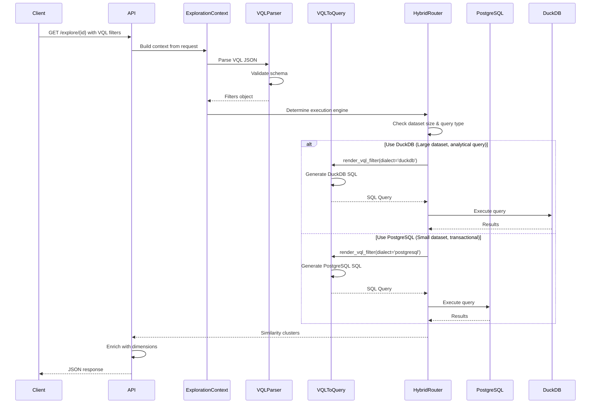
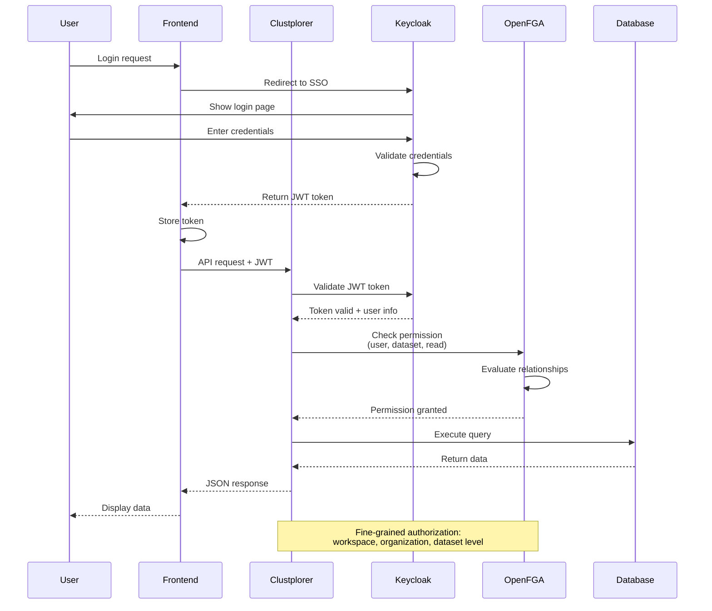
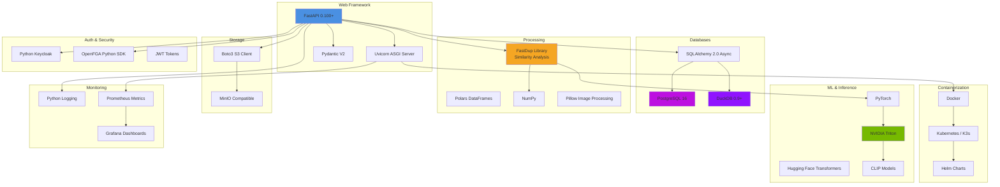

# Visual Layer - Backend Architecture

## Backend System Architecture

```mermaid
graph TB
    subgraph "External Clients"
        Browser[Web Browser]
        API_Client[API Clients]
        CLI[CLI Tools]
    end
    
    subgraph "Load Balancer / Ingress"
        LB[Nginx / K8s Ingress]
    end
    
    subgraph "Application Layer"
        subgraph "Clustplorer (FastAPI)"
            API[API Routers]
            
            subgraph "Web Routes - 30+ Endpoints"
                DS_API[api_datasets<br/>Dataset CRUD]
                EX_API[api_data_exploration<br/>Cluster Queries]
                IMG_API[api_image_search<br/>Visual Search]
                LAB_API[api_labels<br/>Annotations]
                TAG_API[api_tags<br/>User Tags]
                VID_API[api_video_frames<br/>Video Processing]
                EXP_API[api_dataset_export<br/>Export]
                WS_API[api_workspaces<br/>Multi-tenancy]
                ORG_API[api_organizations<br/>Org Management]
                MOD_API[api_models_catalog<br/>Model Registry]
                AUTH_API[auth<br/>Authentication]
                SSO_API[sso<br/>SSO Integration]
            end
            
            subgraph "Business Logic Layer"
                DS_BL[datasets_bl<br/>Dataset Operations]
                IMG_BL[image_similarity_search<br/>Visual Search Logic]
                CTX_BL[exploration_context_builder<br/>Query Builder]
                PERM_BL[permissions_service<br/>Authorization]
                EXP_BL[dataset_export_helpers<br/>Export Logic]
                ING_BL[data_ingestion<br/>Import Logic]
                FW_BL[flywheel<br/>Continuous Learning]
                MT_BL[model_training<br/>Training Workflows]
            end
            
            subgraph "Queue System"
                QW[queue_worker<br/>Async Task Processor]
                TASKS[task_cleanup<br/>Job Management]
            end
            
            subgraph "Middleware"
                CORS[CORS Handler]
                GZIP[Selective GZip]
                TIMING[Timing Middleware]
                EXC[Exception Handlers]
            end
        end
        
        subgraph "Image Proxy Service"
            PROXY[Image Proxy<br/>FastAPI]
            S3_STREAM[S3 Streaming]
            LOCAL_FS[Local File Serving]
        end
    end
    
    subgraph "Data Access Layer - vldbaccess"
        subgraph "Database DAOs"
            DS_DAO[DatasetDB]
            SC_DAO[SimilarityClusterDB<br/>1284 lines - Core Queries]
            IMG_DAO[ImageDB]
            LAB_DAO[LabelDB]
            TAG_DAO[MediaTagsDB]
            ISS_DAO[IssueDB]
            QI_DAO[QueryImageDB]
            USER_DAO[UserDB]
            WS_DAO[WorkspaceDB]
            ORG_DAO[OrganizationDB]
            TQ_DAO[TaskQueueDAO]
        end
        
        subgraph "Query Engine"
            VQL_PARSER[VQL Parser<br/>models/vql.py]
            VQL_QUERY[VQL to SQL<br/>vql_to_query.py]
            SQL_TEMPLATES[SQL Templates<br/>Jinja2]
            HYBRID[Hybrid Query Router<br/>PG + DuckDB]
        end
        
        subgraph "Vector Search"
            VQL_VEC[VQL Vector Embedding]
            IMG_EMB[Image Embeddings]
            QUERY_EMB[Query Embeddings]
        end
        
        subgraph "Connection Management"
            PG_POOL[PostgreSQL Pool]
            DUCK_POOL[DuckDB Pool]
            SESSION[Session Manager]
        end
    end
    
    subgraph "Data Processing - Pipeline"
        subgraph "Pipeline Controller"
            CTRL[controller.py<br/>Flow Orchestrator]
            
            subgraph "Pipeline Flows"
                FULL[full_pipeline_flow]
                PREP[prepare_data_flow]
                ENR[enrichment_flow]
                IDX[indexer_flow]
                PART[partial_update_flow]
                TRAIN[model_training_flow]
            end
        end
        
        subgraph "K8s Job Steps"
            subgraph "Algorithm Steps"
                FD[step_fastdup<br/>Similarity Index]
                ISS[step_issues_generator<br/>Quality Analysis]
                EXPL[step_exploration<br/>Visualization Prep]
            end
            
            subgraph "Data Sync Steps"
                SYNC_IN[sync_data_to_local<br/>Download from S3]
                SYNC_OUT[sync_local_to_s3<br/>Upload Results]
                SYNC_DB[sync_db<br/>DB Updates]
                CLEANUP[delete_local_data<br/>Cleanup]
            end
            
            subgraph "Training Steps"
                MTR[model_training_steps<br/>Camtek Workflows]
            end
        end
    end
    
    subgraph "FastDup Runner"
        FD_RUN[fastdup_runner_pipeline<br/>Local Processing]
        FD_SYNC[fastdup_runner_sync_db<br/>DB Sync]
    end
    
    subgraph "ML Inference"
        TRITON[Triton Inference Server<br/>GPU Acceleration]
        MODELS[Model Repository<br/>Embeddings]
    end
    
    subgraph "Storage Layer"
        subgraph "Databases"
            PG[(PostgreSQL<br/>Primary DB)]
            DUCK[(DuckDB<br/>Analytics)]
        end
        
        subgraph "Object Storage"
            S3[(S3 / MinIO<br/>Images, Thumbnails)]
            CDN[CDN<br/>Media Serving]
        end
        
        subgraph "Cache"
            REDIS[(Redis<br/>Session Cache)]
        end
    end
    
    subgraph "Auth & Authorization"
        KC[Keycloak<br/>SSO & User Management]
        OPENFGA[OpenFGA<br/>Fine-grained Access Control]
    end
    
    subgraph "Provider Integrations"
        CAMTEK[Camtek Provider<br/>TrainClient]
    end
    
    %% Client connections
    Browser --> LB
    API_Client --> LB
    CLI --> LB
    
    %% Load balancer routing
    LB --> API
    LB --> PROXY
    
    %% API to Business Logic
    DS_API --> DS_BL
    EX_API --> CTX_BL
    IMG_API --> IMG_BL
    LAB_API --> PERM_BL
    WS_API --> PERM_BL
    
    %% Business Logic to DAOs
    DS_BL --> DS_DAO
    CTX_BL --> SC_DAO
    IMG_BL --> QI_DAO
    DS_BL --> TQ_DAO
    
    %% DAOs to Query Engine
    SC_DAO --> VQL_PARSER
    SC_DAO --> HYBRID
    DS_DAO --> PG_POOL
    
    %% Query Engine
    VQL_PARSER --> VQL_QUERY
    VQL_QUERY --> SQL_TEMPLATES
    HYBRID --> PG_POOL
    HYBRID --> DUCK_POOL
    
    %% Vector Search
    IMG_BL --> VQL_VEC
    VQL_VEC --> IMG_EMB
    IMG_EMB --> QUERY_EMB
    QUERY_EMB --> PG_POOL
    
    %% Connection to Databases
    PG_POOL --> PG
    DUCK_POOL --> DUCK
    SESSION --> REDIS
    
    %% Image Proxy
    PROXY --> S3_STREAM
    PROXY --> LOCAL_FS
    S3_STREAM --> S3
    LOCAL_FS --> CDN
    
    %% Pipeline flows
    CTRL --> FULL
    FULL --> PREP
    PREP --> ENR
    ENR --> IDX
    
    %% Pipeline Job Steps
    PREP --> SYNC_IN
    ENR --> FD
    FD --> ISS
    ISS --> EXPL
    IDX --> SYNC_DB
    SYNC_DB --> PG
    EXPL --> SYNC_OUT
    SYNC_OUT --> S3
    
    %% Training
    TRAIN --> MTR
    MTR --> CAMTEK
    
    %% FastDup Runner
    FD_RUN --> FD_SYNC
    FD_SYNC --> PG
    
    %% ML Inference
    FD --> TRITON
    TRITON --> MODELS
    IMG_EMB --> TRITON
    
    %% Auth
    AUTH_API --> KC
    SSO_API --> KC
    PERM_BL --> OPENFGA
    
    %% Queue Worker
    TQ_DAO --> QW
    QW --> DS_BL
    QW --> CTRL
    
    style API fill:#4A90E2
    style SC_DAO fill:#D0021B
    style VQL_PARSER fill:#F5A623
    style HYBRID fill:#50E3C2
    style PG fill:#BD10E0
    style DUCK fill:#9013FE
    style S3 fill:#FF6900
    style TRITON fill:#76B900
```



## VQL Query Processing Flow



## Pipeline Execution Flow

```mermaid
stateDiagram-v2
    [*] --> DatasetCreated
    
    DatasetCreated --> QueueTask: User uploads data
    QueueTask --> PrepareData: Queue worker picks task
    
    PrepareData --> NormalizeDataset: Download from S3
    NormalizeDataset --> ValidateImages: Extract metadata
    ValidateImages --> StepFastdup: Validation complete
    
    StepFastdup --> ExtractEmbeddings: Start processing
    ExtractEmbeddings --> ComputeSimilarity: Generate features
    ComputeSimilarity --> BuildClusters: Find neighbors
    BuildClusters --> GenerateThumbnails: Cluster formation
    GenerateThumbnails --> StepIssues: Save metadata
    
    StepIssues --> DetectDuplicates: Analyze quality
    DetectDuplicates --> DetectOutliers: Find dupes
    DetectOutliers --> DetectBlur: Identify outliers
    DetectBlur --> DetectDarkBright: Check blur
    DetectDarkBright --> StepExploration: Assess exposure
    
    StepExploration --> AggregateStats: Create views
    AggregateStats --> SelectPreviews: Compute metrics
    SelectPreviews --> SyncDB: Choose thumbnails
    
    SyncDB --> InsertClusters: Sync to PostgreSQL
    InsertClusters --> InsertIssues: Write clusters
    InsertIssues --> UpdateStatus: Write issues
    UpdateStatus --> SyncToS3: Mark as READY
    
    SyncToS3 --> UploadThumbnails: Upload to S3
    UploadThumbnails --> UploadMetadata: Save thumbs
    UploadMetadata --> Cleanup: Save parquet
    
    Cleanup --> [*]: Delete local files
    
    StepFastdup --> Error: Processing failed
    StepIssues --> Error: Analysis failed
    SyncDB --> Error: DB error
    Error --> NotifyError: Log error
    NotifyError --> [*]: Mark as FAILED
```



## Database Schema - Core Tables

```mermaid
erDiagram
    datasets ||--o{ images : contains
    datasets ||--o{ similarity_clusters : has
    datasets ||--o{ flat_similarity_clusters : denormalized
    datasets ||--o{ labels : has
    datasets ||--o{ tags : has
    
    images ||--o{ objects : contains
    images ||--o{ labels : annotated_with
    images ||--o{ image_vector : has_embedding
    images ||--o{ media_to_tags : tagged_with
    images ||--o{ media_to_captions : captioned_with
    
    similarity_clusters ||--o{ flat_similarity_clusters : materialized
    
    objects ||--o{ labels : annotated_with
    objects ||--o{ objects_to_images : belongs_to
    
    labels ||--o{ label_category : categorized_by
    
    users ||--o{ workspaces : member_of
    workspaces ||--o{ organizations : belongs_to
    workspaces ||--o{ datasets : owns
    
    tags ||--o{ media_to_tags : applied_to
    
    processing_tasks ||--o{ datasets : processes
    flow_runs ||--o{ datasets : executes_on
    
    datasets {
        uuid id PK
        string name
        string status
        int n_images
        int n_videos
        int n_video_frames
        timestamp created_at
        uuid workspace_id FK
    }
    
    images {
        uuid id PK
        uuid dataset_id FK
        string image_uri
        string original_uri
        jsonb metadata
        int width
        int height
        bigint size_bytes
    }
    
    objects {
        uuid id PK
        uuid image_id FK
        string display_name
        jsonb bounding_box
        float confidence
    }
    
    similarity_clusters {
        uuid id PK
        uuid dataset_id FK
        int similarity_threshold
        string cluster_type
        int n_images
        int n_objects
        string formed_by
    }
    
    flat_similarity_clusters {
        uuid dataset_id PK_PARTITION
        uuid cluster_id PK
        uuid image_id
        string image_uri
        jsonb labels
        jsonb metadata
        int similarity_threshold
        int preview_order
    }
    
    labels {
        uuid id PK
        uuid dataset_id FK
        string display_name
        string category_display_name
        int label_source
    }
    
    image_vector {
        uuid image_id PK
        vector embedding
        string model_name
    }
    
    tags {
        uuid id PK
        uuid dataset_id FK
        string name
        timestamp created_at
    }
    
    media_to_tags {
        uuid media_id FK
        uuid tag_id FK
    }
    
    users {
        string user_id PK
        string email
        string name
    }
    
    workspaces {
        uuid id PK
        string name
        uuid organization_id FK
    }
    
    processing_tasks {
        uuid id PK
        uuid dataset_id FK
        string task_type
        string status
        jsonb payload
    }
```

## Authentication & Authorization Flow



## Multi-Tenancy Structure

```mermaid
graph TB
    subgraph "Tenant Hierarchy"
        ORG[Organization]
        
        ORG --> WS1[Workspace 1]
        ORG --> WS2[Workspace 2]
        ORG --> WS3[Workspace 3]
        
        WS1 --> DS1[Dataset A]
        WS1 --> DS2[Dataset B]
        
        WS2 --> DS3[Dataset C]
        WS2 --> DS4[Dataset D]
        
        WS3 --> DS5[Dataset E]
        
        subgraph "Access Control"
            U1[User 1<br/>Admin]
            U2[User 2<br/>Viewer]
            U3[User 3<br/>Editor]
        end
        
        U1 -.->|Full Access| ORG
        U2 -.->|Read Only| WS1
        U3 -.->|Read/Write| WS2
    end
    
    subgraph "OpenFGA Tuples"
        T1[org:123#admin@user:1]
        T2[workspace:ws1#viewer@user:2]
        T3[workspace:ws2#editor@user:3]
        T4[dataset:ds1#workspace@workspace:ws1]
    end
    
    U1 --> T1
    U2 --> T2
    U3 --> T3
    DS1 --> T4
    
    style ORG fill:#4A90E2
    style WS1 fill:#50E3C2
    style WS2 fill:#50E3C2
    style WS3 fill:#50E3C2
    style U1 fill:#D0021B
```

## Technology Stack


