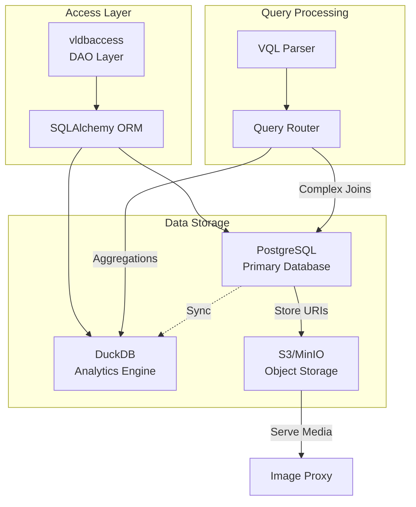
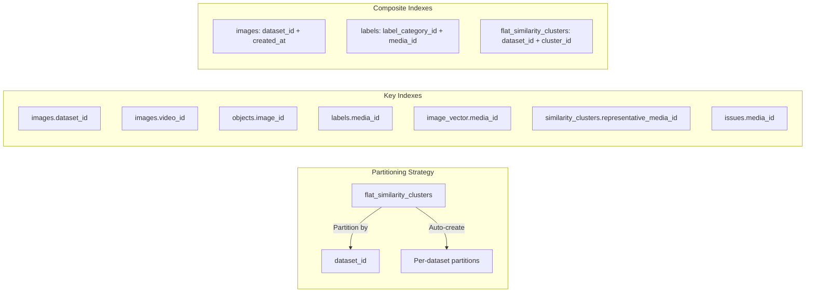
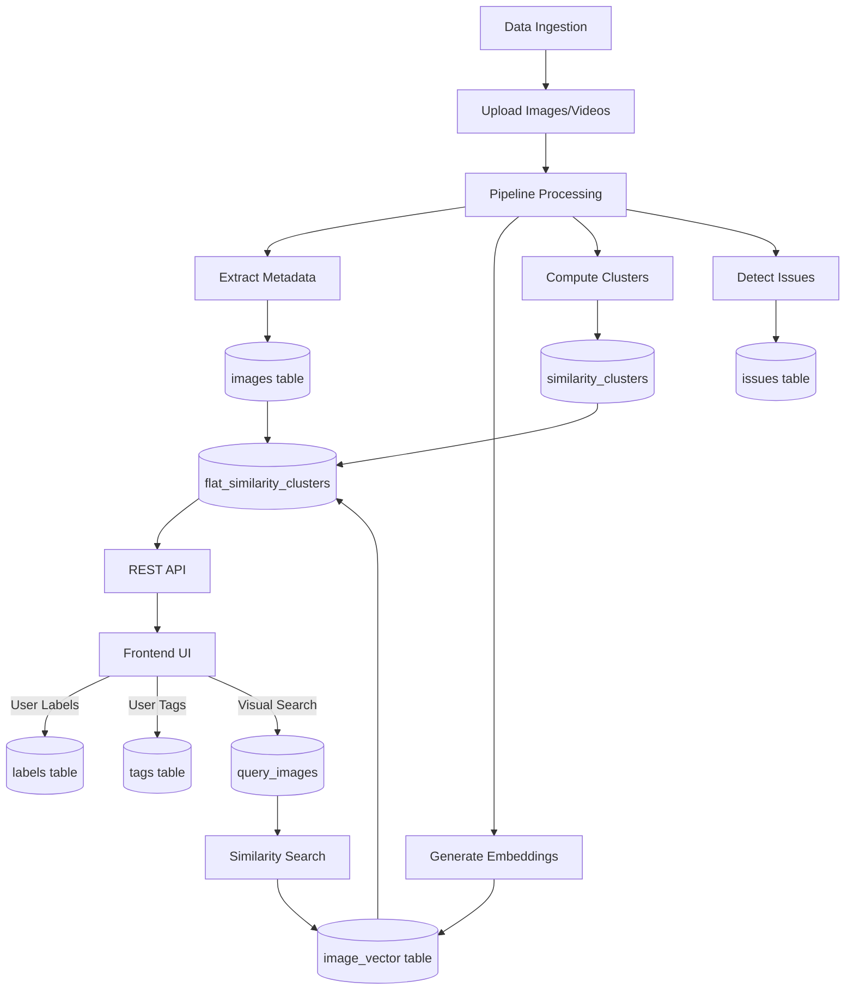

# Visual Layer - Database Schema Diagram

## Entity Relationship Diagram (ERD)

```mermaid
erDiagram
    %% Multi-Tenancy & Authentication
    organizations ||--o{ workspaces : "contains"
    organizations ||--o{ users : "has members"
    workspaces ||--o{ users : "has members"
    workspaces ||--o{ datasets : "owns"
    users ||--o{ query_images : "uploads"
    users ||--o{ events : "performs"
    
    %% Core Dataset Structure
    datasets ||--o{ images : "contains"
    datasets ||--o{ videos : "contains"
    datasets ||--o{ objects : "contains"
    datasets ||--o{ similarity_clusters : "has clusters"
    datasets ||--o{ flat_similarity_clusters : "denormalized view"
    datasets ||--o{ label_categories : "has categories"
    datasets ||--o{ issues : "has quality issues"
    datasets ||--o{ tags : "has tags"
    datasets ||--o{ flow_runs : "processing history"
    datasets ||--o{ dataset_exports : "export history"
    datasets ||--o{ image_vector : "embeddings"
    
    %% Media Hierarchy
    videos ||--o{ images : "extracted frames"
    images ||--o{ objects : "detected objects"
    images ||--o{ image_vector : "has embedding"
    objects ||--o{ image_vector : "has embedding"
    
    %% Labeling System
    label_categories ||--o{ labels : "contains"
    labels }o--o{ images : "annotated on"
    labels }o--o{ objects : "annotated on"
    label_categories ||--o{ model_training_labels : "training labels"
    
    %% Tagging System
    tags }o--o{ images : "tagged via media_to_tags"
    tags }o--o{ objects : "tagged via media_to_tags"
    
    %% Similarity Clustering
    similarity_clusters ||--o{ similarity_cluster_items : "contains items"
    similarity_cluster_items }o--|| images : "references"
    similarity_cluster_items }o--|| objects : "references"
    flat_similarity_clusters }o--|| images : "references"
    flat_similarity_clusters }o--|| objects : "references"
    
    %% Issues & Quality
    issue_types ||--o{ issues : "categorizes"
    issues }o--|| images : "detected on"
    issues }o--|| objects : "detected on"
    
    %% Visual Similarity Search
    query_images ||--o{ query_vector_embedding : "has embedding"
    query_vector_embedding }o--o{ images : "similar to"
    query_vector_embedding }o--o{ objects : "similar to"
    
    %% Pipeline & Processing
    flow_runs ||--o{ processing_tasks : "generates tasks"
    datasets ||--o{ processing_tasks : "processing queue"
    
    %% Model Training (Camtek)
    datasets ||--o{ model_training_runs : "training sessions"
    model_training_runs ||--o{ model_training_labels : "training data"
    model_training_runs ||--o{ model_training_results : "results"
    model_training_labels }o--|| images : "trains on"
    
    %% Enrichment & ML Models
    datasets ||--o{ enrichment_jobs : "enrichment tasks"
    model_catalog ||--o{ enrichment_jobs : "uses model"
    
    %% Organizations
    organizations {
        uuid id PK
        string name
        json settings
        timestamp created_at
        timestamp updated_at
    }
    
    %% Workspaces
    workspaces {
        uuid id PK
        uuid organization_id FK
        string name
        json settings
        timestamp created_at
        timestamp updated_at
    }
    
    %% Users
    users {
        uuid id PK
        string email UK
        string name
        string keycloak_id UK
        uuid organization_id FK
        json preferences
        timestamp created_at
        timestamp last_login
    }
    
    %% Datasets
    datasets {
        uuid id PK
        uuid workspace_id FK
        string name
        string status
        string dataset_type
        json provider_config
        json embedding_config
        int total_images
        int total_objects
        int total_clusters
        json statistics
        timestamp created_at
        timestamp updated_at
        timestamp processed_at
    }
    
    %% Images
    images {
        uuid id PK
        uuid dataset_id FK
        uuid video_id FK "nullable"
        string image_uri
        string thumbnail_uri
        int width
        int height
        int file_size
        string format
        json metadata
        float mean_cluster_distance
        float uniqueness_score
        timestamp created_at
        timestamp captured_at
    }
    
    %% Videos
    videos {
        uuid id PK
        uuid dataset_id FK
        string video_uri
        string thumbnail_uri
        int duration_ms
        int frame_count
        float fps
        json metadata
        timestamp created_at
    }
    
    %% Objects (Detected)
    objects {
        uuid id PK
        uuid dataset_id FK
        uuid image_id FK
        string object_type
        float confidence
        json bounding_box
        string crop_uri
        float mean_cluster_distance
        float uniqueness_score
        json metadata
        timestamp created_at
    }
    
    %% Similarity Clusters
    similarity_clusters {
        uuid id PK
        uuid dataset_id FK
        string cluster_type
        string anchor_type
        int cluster_size
        uuid representative_media_id FK
        float avg_distance
        json metadata
        timestamp created_at
    }
    
    %% Similarity Cluster Items
    similarity_cluster_items {
        uuid id PK
        uuid similarity_cluster_id FK
        uuid media_id FK
        string media_type
        float distance
        int rank
        timestamp created_at
    }
    
    %% Flat Similarity Clusters (Denormalized)
    flat_similarity_clusters {
        uuid dataset_id FK "partition key"
        uuid similarity_cluster_id FK
        uuid media_id FK
        string media_type
        string cluster_type
        string anchor_type
        float distance
        int rank
        int cluster_size
        uuid representative_media_id
        timestamp created_at
    }
    
    %% Label Categories
    label_categories {
        uuid id PK
        uuid dataset_id FK
        string name
        string category_type
        json metadata
        timestamp created_at
    }
    
    %% Labels
    labels {
        uuid id PK
        uuid label_category_id FK
        uuid media_id FK
        string media_type
        string label_value
        float confidence
        json bounding_box "nullable"
        string source
        json metadata
        timestamp created_at
        timestamp updated_at
    }
    
    %% Tags
    tags {
        uuid id PK
        uuid dataset_id FK
        string name
        string color
        int usage_count
        timestamp created_at
    }
    
    %% Media to Tags (Many-to-Many)
    media_to_tags {
        uuid id PK
        uuid tag_id FK
        uuid media_id FK
        string media_type
        uuid user_id FK
        timestamp created_at
    }
    
    %% Issues
    issues {
        uuid id PK
        uuid dataset_id FK
        uuid issue_type_id FK
        uuid media_id FK
        string media_type
        string severity
        float confidence
        json details
        string status
        timestamp created_at
        timestamp resolved_at
    }
    
    %% Issue Types
    issue_types {
        uuid id PK
        string name
        string category
        string description
        json detection_config
        timestamp created_at
    }
    
    %% Image Vectors (Embeddings)
    image_vector {
        uuid id PK
        uuid dataset_id FK
        uuid media_id FK
        bool is_image
        string vector_embedding_type
        vector embedding "high-dimensional"
        timestamp created_at
    }
    
    %% Query Images (Uploaded for Search)
    query_images {
        uuid id PK
        uuid user_id FK
        uuid dataset_id FK
        string image_uri
        json crop_coordinates "nullable"
        timestamp created_at
        timestamp expires_at
    }
    
    %% Query Vector Embeddings (Cached)
    query_vector_embedding {
        uuid id PK
        uuid query_image_id FK
        string vector_embedding_type
        vector embedding
        json similar_media_ids "cached results"
        timestamp created_at
    }
    
    %% Flow Runs (Pipeline Execution)
    flow_runs {
        uuid id PK
        uuid dataset_id FK
        string flow_type
        string status
        json parameters
        json error_details
        timestamp started_at
        timestamp completed_at
        int duration_seconds
    }
    
    %% Processing Tasks (Background Jobs)
    processing_tasks {
        uuid id PK
        uuid dataset_id FK
        uuid flow_run_id FK
        string task_type
        string status
        int priority
        json payload
        json result
        int retry_count
        timestamp created_at
        timestamp started_at
        timestamp completed_at
    }
    
    %% Events (Audit Log)
    events {
        uuid id PK
        uuid user_id FK
        uuid dataset_id FK
        string event_type
        string entity_type
        uuid entity_id
        json payload
        string ip_address
        timestamp created_at
    }
    
    %% Dataset Exports
    dataset_exports {
        uuid id PK
        uuid dataset_id FK
        uuid user_id FK
        string export_format
        string status
        string file_uri
        json export_config
        int item_count
        timestamp created_at
        timestamp completed_at
    }
    
    %% Model Catalog
    model_catalog {
        uuid id PK
        string model_name
        string model_type
        string version
        json configuration
        string triton_model_name
        bool is_active
        timestamp created_at
    }
    
    %% Enrichment Jobs
    enrichment_jobs {
        uuid id PK
        uuid dataset_id FK
        uuid model_id FK
        string status
        json configuration
        int processed_items
        int total_items
        timestamp started_at
        timestamp completed_at
    }
    
    %% Model Training Runs (Camtek)
    model_training_runs {
        uuid id PK
        uuid dataset_id FK
        string training_type
        string status
        json hyperparameters
        json metrics
        string model_output_path
        timestamp started_at
        timestamp completed_at
    }
    
    %% Model Training Labels
    model_training_labels {
        uuid id PK
        uuid training_run_id FK
        uuid label_category_id FK
        uuid image_id FK
        string split_type "train/val/test"
        json augmentation_config
        timestamp created_at
    }
    
    %% Model Training Results
    model_training_results {
        uuid id PK
        uuid training_run_id FK
        int epoch
        float train_loss
        float val_loss
        json metrics
        timestamp created_at
    }
```

## Database Technology Stack

## Key Indexes & Performance

## Data Flow Diagram

## Table Size & Growth Estimates

| Table | Size Factor | Growth Rate |
|-------|-------------|-------------|
| `images` | 1× dataset size | Linear with uploads |
| `objects` | 5-10× images | Based on detection density |
| `image_vector` | 1-2× (images + objects) | One per media item |
| `flat_similarity_clusters` | 50× images | Each image in ~50 clusters |
| `similarity_clusters` | 0.1× images | ~10% as many clusters |
| `labels` | 0.5-2× images | Based on annotation effort |
| `issues` | 0.1-0.5× images | Quality-dependent |
| `flow_runs` | Constant per dataset | One per processing run |

## Critical Queries

### Most Frequent Queries:
1. **Data Exploration** - `flat_similarity_clusters` with VQL filters
2. **Visual Similarity Search** - `image_vector` cosine distance
3. **Label Statistics** - Aggregates on `labels` joined with `images`
4. **Issue Detection** - `issues` grouped by type/severity
5. **Cluster Preview** - Top 100 items per cluster

### Query Optimization Strategy:
- **PostgreSQL**: Metadata queries, complex joins, transactions
- **DuckDB**: Aggregations, analytical queries, large scans
- **Partitioning**: `flat_similarity_clusters` by `dataset_id`
- **Caching**: Query results in Redis (not shown in schema)
