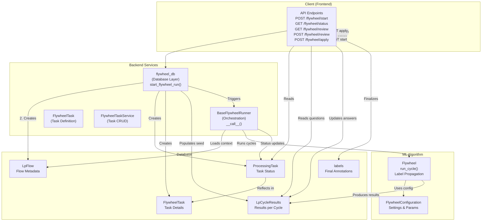
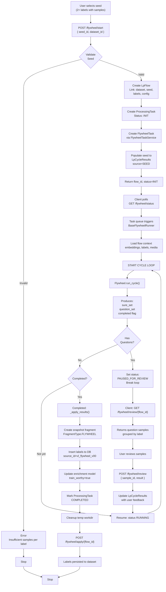
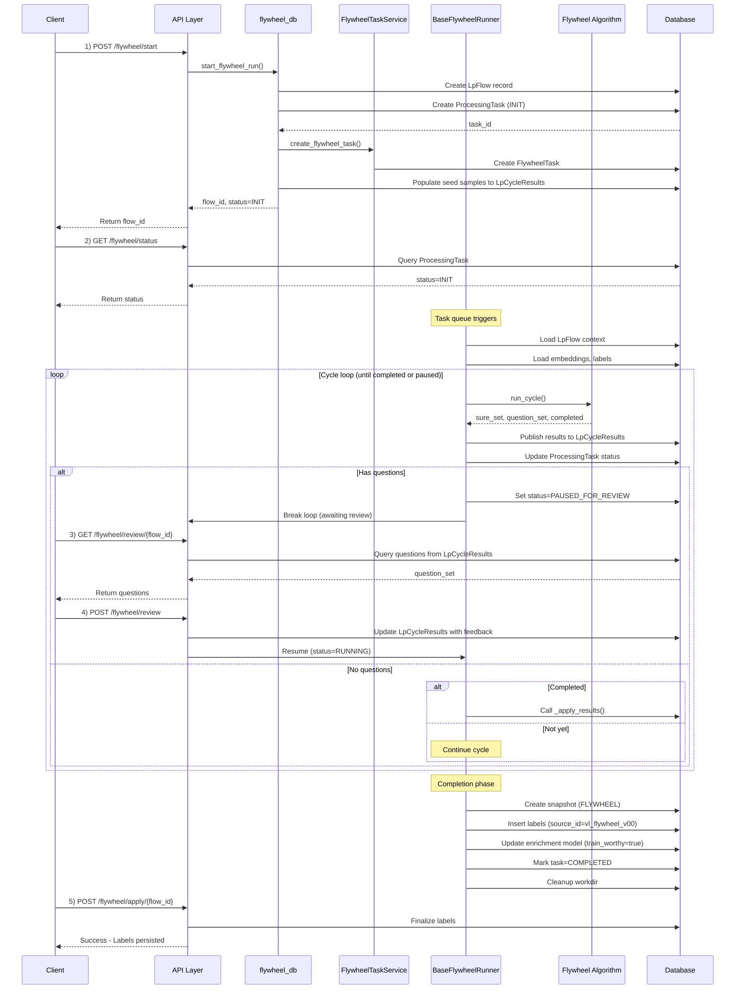
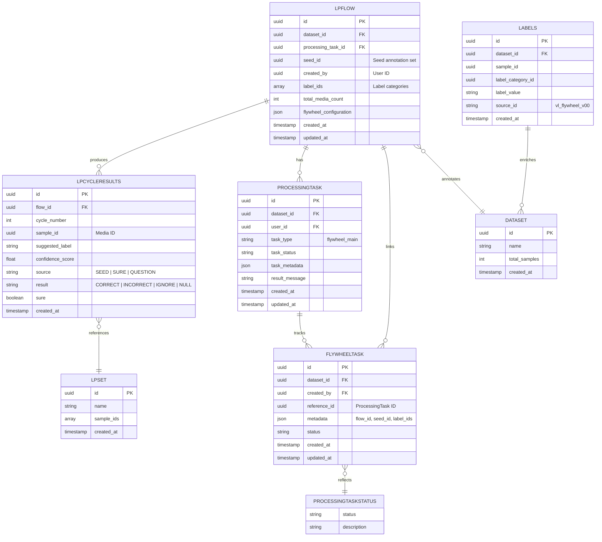

# Flywheel Diagrams

## Architecture Overview

```mermaid
graph TB
    subgraph Client["Client (Frontend)"]
        API["API Endpoints<br/>POST /flywheel/start<br/>GET /flywheel/status<br/>GET /flywheel/review<br/>POST /flywheel/review<br/>POST /flywheel/apply"]
    end

    subgraph Backend["Backend Services"]
        FDB["flywheel_db<br/>(Database Layer)<br/>start_flywheel_run()"]
        Runner["BaseFlywheelRunner<br/>(Orchestration)<br/>__call__()"]
        FT["FlywheelTask<br/>(Task Definition)"]
        FTS["FlywheelTaskService<br/>(Task CRUD)"]
    end

    subgraph Algorithm["ML Algorithm"]
        FW["Flywheel<br/>run_cycle()<br/>Label Propagation"]
        FC["FlywheelConfiguration<br/>Settings & Params"]
    end

    subgraph Database["Database"]
        LpFlow["LpFlow<br/>Flow Metadata"]
        LpCycle["LpCycleResults<br/>Results per Cycle"]
        ProTask["ProcessingTask<br/>Task Status"]
        FWTask["FlywheelTask<br/>Task Details"]
        Labels["labels<br/>Final Annotations"]
    end

    Client -->|"1. POST start"| API
    API --> FDB
    FDB -->|"2. Creates"| LpFlow
    FDB -->|"Creates"| ProTask
    FDB -->|"Creates"| FWTask
    FDB -->|"Populates seed"| LpCycle

    FDB -->|"Triggers"| Runner
    Runner -->|"Loads context"| LpFlow
    Runner -->|"Runs cycles"| FW
    FW -->|"Uses config"| FC
    FW -->|"Produces results"| LpCycle

    Runner -->|"Status updates"| ProTask
    ProTask -->|"Reflects in"| FWTask

    Client -->|"2. GET status"| API
    API -->|"Reads"| ProTask

    Client -->|"3. GET review"| API
    API -->|"Reads questions"| LpCycle

    Client -->|"4. POST review"| API
    API -->|"Updates answers"| LpCycle

    Client -->|"5. POST apply"| API
    API -->|"Finalizes"| Labels
```

## Execution Flow (Client to Server)

```mermaid
graph TD
    A["User selects seed<br/>(2+ labels with samples)"] --> B["POST /flywheel/start<br/>{ seed_id, dataset_id }"]

    B --> C{"Validate<br/>Seed"}
    C -->|"Invalid"| D["Error<br/>Insufficient samples per label"]
    D --> E["Stop"]

    C -->|"Valid"| F["Create LpFlow<br/>Link: dataset, seed,<br/>labels, config"]
    F --> G["Create ProcessingTask<br/>Status: INIT"]
    G --> H["Create FlywheelTask<br/>via FlywheelTaskService"]
    H --> I["Populate seed to<br/>LpCycleResults<br/>source=SEED"]

    I --> J["Return flow_id, status=INIT"]
    J --> K["Client polls<br/>GET /flywheel/status"]

    K --> L["Task queue triggers<br/>BaseFlywheelRunner"]
    L --> M["Load flow context<br/>embeddings, labels, media"]

    M --> N["START CYCLE LOOP"]
    N --> O["Flywheel.run_cycle()"]
    O --> P["Produces:<br/>sure_set<br/>question_set<br/>completed flag"]

    P --> Q{"Has<br/>Questions?"}
    Q -->|"No"| R{"Completed?"}
    Q -->|"Yes"| S["Set status:<br/>PAUSED_FOR_REVIEW<br/>Break loop"]
    S --> T["Client: GET /flywheel/review/{flow_id}"]
    T --> U["Returns question samples<br/>grouped by label"]

    U --> V["User reviews samples"]
    V --> W["POST /flywheel/review<br/>{ sample_id, result }"]
    W --> X["Update LpCycleResults<br/>with user feedback"]
    X --> Y["Resume: status RUNNING"]
    Y --> N

    R -->|"Not yet"| Y
    R -->|"Yes"| Z["Completed: _apply_results()"]

    Z --> AA["Create snapshot fragment<br/>FragmentType.FLYWHEEL"]
    AA --> AB["Insert labels to DB<br/>source_id=vl_flywheel_v00"]
    AB --> AC["Update enrichment model<br/>train_worthy=true"]
    AC --> AD["Mark ProcessingTask<br/>COMPLETED"]
    AD --> AE["Cleanup temp workdir"]

    AE --> AF["POST /flywheel/apply/{flow_id}"]
    AF --> AG["Labels persisted to dataset"]

    E --> AH["Stop"]
    AG --> AH
```

## Sequence Diagram (Component Interactions)

```mermaid
sequenceDiagram
    participant Client as Client
    participant API as API Layer
    participant FDB as flywheel_db
    participant TaskSvc as FlywheelTaskService
    participant Runner as BaseFlywheelRunner
    participant Algo as Flywheel Algorithm
    participant DB as Database

    Client->>API: 1) POST /flywheel/start
    API->>FDB: start_flywheel_run()

    FDB->>DB: Create LpFlow record
    FDB->>DB: Create ProcessingTask (INIT)
    DB-->>FDB: task_id
    FDB->>TaskSvc: create_flywheel_task()
    TaskSvc->>DB: Create FlywheelTask
    FDB->>DB: Populate seed samples to LpCycleResults

    FDB-->>API: flow_id, status=INIT
    API-->>Client: Return flow_id

    Client->>API: 2) GET /flywheel/status
    API->>DB: Query ProcessingTask
    DB-->>API: status=INIT
    API-->>Client: Return status

    Note over Runner: Task queue triggers
    Runner->>DB: Load LpFlow context
    Runner->>DB: Load embeddings, labels

    loop Cycle loop (until completed or paused)
        Runner->>Algo: run_cycle()
        Algo-->>Runner: sure_set, question_set, completed
        Runner->>DB: Publish results to LpCycleResults
        Runner->>DB: Update ProcessingTask status

        alt Has questions
            Runner->>DB: Set status=PAUSED_FOR_REVIEW
            Runner->>API: Break loop (awaiting review)

            Client->>API: 3) GET /flywheel/review/{flow_id}
            API->>DB: Query questions from LpCycleResults
            DB-->>API: question_set
            API-->>Client: Return questions

            Client->>API: 4) POST /flywheel/review
            API->>DB: Update LpCycleResults with feedback
            API->>Runner: Resume (status=RUNNING)
        else No questions
            alt Completed
                Runner->>DB: Call _apply_results()
            else Not yet
                Note over Runner: Continue cycle
            end
        end
    end

    Note over Runner: Completion phase
    Runner->>DB: Create snapshot (FLYWHEEL)
    Runner->>DB: Insert labels (source_id=vl_flywheel_v00)
    Runner->>DB: Update enrichment model (train_worthy=true)
    Runner->>DB: Mark task=COMPLETED
    Runner->>DB: Cleanup workdir

    Client->>API: 5) POST /flywheel/apply/{flow_id}
    API->>DB: Finalize labels
    API-->>Client: Success - Labels persisted
```

## Database Schema (ERD)

```mermaid
erDiagram
    LPFLOW ||--o{ LPCYCLERESULTS : "produces"
    LPFLOW ||--o{ PROCESSINGTASK : "has"
    LPFLOW ||--o{ FLYWHEELTASK : "links"
    PROCESSINGTASK ||--o{ FLYWHEELTASK : "tracks"
    LPCYCLERESULTS }o--|| LPSET : "references"
    LPFLOW }o--|| DATASET : "annotates"
    FLYWHEELTASK }o--|| PROCESSINGTASKSTATUS : "reflects"
    LABELS ||--o{ DATASET : "enriches"

    LPFLOW {
        uuid id PK
        uuid dataset_id FK
        uuid processing_task_id FK
        uuid seed_id "Seed annotation set"
        uuid created_by "User ID"
        array label_ids "Label categories"
        int total_media_count
        json flywheel_configuration
        timestamp created_at
        timestamp updated_at
    }

    LPCYCLERESULTS {
        uuid id PK
        uuid flow_id FK
        int cycle_number
        uuid sample_id "Media ID"
        string suggested_label
        float confidence_score
        string source "SEED | SURE | QUESTION"
        string result "CORRECT | INCORRECT | IGNORE | NULL"
        boolean sure
        timestamp created_at
    }

    LPSET {
        uuid id PK
        string name
        array sample_ids
        timestamp created_at
    }

    PROCESSINGTASK {
        uuid id PK
        uuid dataset_id FK
        uuid user_id FK
        string task_type "flywheel_main"
        string task_status
        json task_metadata
        string result_message
        timestamp created_at
        timestamp updated_at
    }

    FLYWHEELTASK {
        uuid id PK
        uuid dataset_id FK
        uuid created_by FK
        uuid reference_id "ProcessingTask ID"
        json metadata "flow_id, seed_id, label_ids"
        string status
        timestamp created_at
        timestamp updated_at
    }

    PROCESSINGTASKSTATUS {
        string status
        string description
    }

    DATASET {
        uuid id PK
        string name
        int total_samples
        timestamp created_at
    }

    LABELS {
        uuid id PK
        uuid dataset_id FK
        uuid sample_id
        uuid label_category_id
        string label_value
        string source_id "vl_flywheel_v00"
        timestamp created_at
    }
```

## Cycle Loop and Data Flow

```mermaid
graph LR
    subgraph Input["Input (Per Cycle)"]
        Seed["Seed labels<br/>(SEED source)"]
        Sure["Sure results<br/>(from prev cycles)"]
        Media["Media embeddings and features"]
        Config["Flywheel config<br/>(thresholds, etc)"]
    end

    subgraph Algo["Label Propagation Algorithm"]
        Model["Similarity model<br/>(Embedding-based)"]
        Prop["Propagation of labels"]
        Score["Confidence scoring"]
        Sep["Split by threshold"]
    end

    subgraph Output["Output"]
        SureSet["SURE SET<br/>(confident)"]
        QuestionSet["QUESTION SET<br/>(uncertain)"]
        Ignore["IGNORE SET<br/>(low confidence)"]
    end

    subgraph Feedback["User Review"]
        Review["User validates questions"]
        Correct["CORRECT -> Add to SURE"]
        Incorrect["INCORRECT -> IGNORE/REASSIGN"]
        Result["Update LpCycleResults"]
    end

    subgraph Decision["Decision Gate"]
        Check1{"All questions answered?"}
        Check2{"Goal achieved?"}
        Resume["Resume next cycle"]
        Complete["Complete and apply results"]
    end

    Seed --> Model
    Sure --> Model
    Media --> Model
    Config --> Model

    Model --> Prop
    Prop --> Score
    Score --> Sep

    Sep --> SureSet
    Sep --> QuestionSet
    Sep --> Ignore

    QuestionSet --> Review
    Review --> Correct
    Review --> Incorrect
    Correct --> Result
    Incorrect --> Result

    Result --> Check1
    Check1 -->|Yes| Check2
    Check1 -->|No| Resume

    Check2 -->|No| Resume
    Check2 -->|Yes| Complete

    Resume -.->|Loop back| Seed
    Complete --> Persist["Persist labels to dataset"]
```
