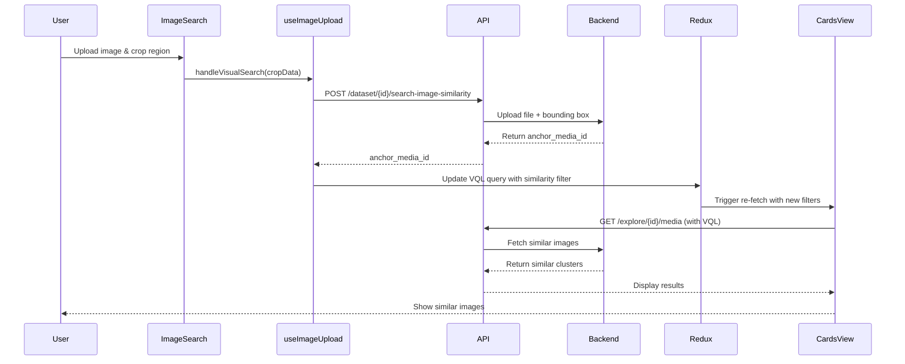
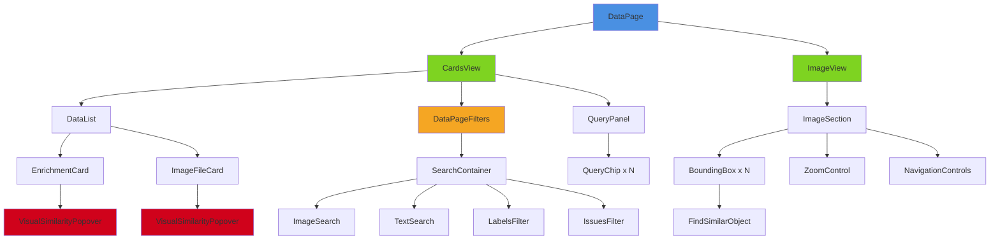
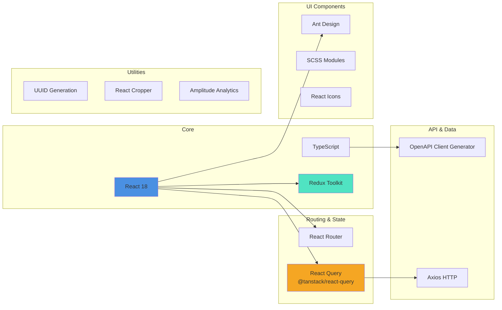

# Visual Layer - Frontend Architecture

## Frontend Block Diagram

```mermaid
graph TB
    subgraph "User Browser"
        subgraph "React Application (fe/clustplorer/src/)"
            UI[UI Layer - views/]
            
            subgraph "Pages"
                DataPage[DataPage<br/>Main Exploration]
                DatasetsPage[DatasetsPage<br/>Dataset List]
                CreatePage[CreateDatasetPage<br/>Upload Wizard]
                TrainingPage[ModelTrainingPage<br/>Training Workflows]
            end
            
            subgraph "Components"
                Cards[CardsView<br/>Grid/List Display]
                ImageView[ImageView<br/>Detail View]
                Filters[DataPageFilters<br/>VQL UI]
                QueryPanel[QueryPanel<br/>Active Filters]
                VisualSim[VisualSimilarityPopover<br/>Threshold Control]
                BBox[BoundingBox<br/>Object Selection]
                ImageSearch[ImageSearch<br/>Upload & Crop]
            end
            
            subgraph "State Management - Redux Store"
                SD[singleDataset<br/>Exploration State]
                DS[datasets<br/>List State]
                SI[singleImage<br/>Image Detail]
                MOD[modals<br/>UI State]
                META[metadata<br/>Summary Data]
                USER[user<br/>Auth Info]
                CREATE[createDataset<br/>Wizard State]
                ENRICH[enrichment<br/>ML State]
            end
            
            subgraph "Hooks & Logic"
                VQLHook[useVqlParams<br/>Filter State]
                ImgHook[useVisualSimilarityImages<br/>Fetch Similar]
                UploadHook[useImageUpload<br/>Search Upload]
                FiltersHook[useAllQueryParamsFilters<br/>URL Sync]
            end
            
            subgraph "API Client - vl-api/"
                API[Auto-generated Client<br/>OpenAPI + React Query]
                Types[Type Definitions<br/>vlSchemas.ts]
            end
            
            subgraph "Utilities"
                VQLHelpers[vqlHelpers.ts<br/>Query Builders]
                Utils[utilities.ts<br/>Common Functions]
                Amplitude[Analytics<br/>Tracking]
            end
        end
    end
    
    subgraph "External Services"
        Backend[Backend API<br/>Clustplorer]
        Keycloak[Keycloak<br/>SSO Auth]
        S3[S3/CDN<br/>Images]
    end
    
    %% Page to Component connections
    DataPage --> Cards
    DataPage --> ImageView
    DataPage --> Filters
    DataPage --> QueryPanel
    
    Cards --> VisualSim
    ImageView --> BBox
    Filters --> ImageSearch
    
    %% Component to State connections
    Cards --> SD
    ImageView --> SI
    Filters --> SD
    QueryPanel --> SD
    
    %% Hooks to State
    VQLHook --> SD
    ImgHook --> API
    UploadHook --> API
    FiltersHook --> VQLHook
    
    %% Components to Hooks
    Filters --> VQLHook
    QueryPanel --> VQLHook
    Cards --> ImgHook
    ImageView --> ImgHook
    ImageSearch --> UploadHook
    
    %% Utilities
    Filters --> VQLHelpers
    QueryPanel --> VQLHelpers
    Cards --> Utils
    ImageView --> Amplitude
    
    %% State to Store
    SD --> API
    DS --> API
    SI --> API
    CREATE --> API
    ENRICH --> API
    
    %% API to Backend
    API --> Backend
    USER --> Keycloak
    ImageView --> S3
    Cards --> S3
    
    style DataPage fill:#4A90E2
    style Cards fill:#7ED321
    style ImageView fill:#7ED321
    style Filters fill:#7ED321
    style VQLHook fill:#F5A623
    style API fill:#D0021B
    style Backend fill:#BD10E0
    style SD fill:#50E3C2
```



## Data Flow - Visual Similarity Search



## VQL Filter Flow

```mermaid
graph LR
    subgraph "User Actions"
        A[Select Label Filter]
        B[Search by Text]
        C[Click Find Similar]
        D[Apply Date Range]
    end
    
    subgraph "VQL Helpers"
        A --> E[createAndUpdateLabelsFilter]
        B --> F[createAndUpdateSearchTextFilter]
        C --> G[createAndUpdateVisualSimilarityFilter]
        D --> H[createAndUpdateDateFilter]
    end
    
    subgraph "VQL Management"
        E --> I[useVqlParams Hook]
        F --> I
        G --> I
        H --> I
        I --> J[VQL Query Array]
    end
    
    subgraph "URL Sync"
        J --> K[URL Query Parameter<br/>?vql=[...]]
        K --> L[Browser History]
    end
    
    subgraph "API Call"
        J --> M[explorationContext]
        M --> N[Backend API Request]
        N --> O[VQL Parser]
        O --> P[SQL Query Generator]
    end
    
    subgraph "Results"
        P --> Q[Database Query]
        Q --> R[Filtered Results]
        R --> S[CardsView Render]
    end
    
    style I fill:#F5A623
    style J fill:#50E3C2
    style N fill:#D0021B
```

## Component Hierarchy - DataPage



## Redux State Structure

```mermaid
graph TB
    Store[Redux Store] --> SD[singleDataset]
    Store --> DS[datasets]
    Store --> SI[singleImage]
    Store --> MOD[modals]
    Store --> META[metadata]
    Store --> USER[user]
    Store --> CREATE[createDataset]
    Store --> ENRICH[enrichment]
    
    SD --> Clusters[clusters: Array]
    SD --> Filters[filters: Object]
    SD --> Loading[isLoading: boolean]
    SD --> Pagination[pagination: Object]
    SD --> Selected[selectedItems: Array]
    SD --> Navigation[navigationContext: Array]
    
    DS --> List[datasetList: Array]
    DS --> Stats[statistics: Object]
    
    SI --> ImgData[imageData: Object]
    SI --> Labels[labels: Array]
    SI --> Objects[objects: Array]
    
    MOD --> ModalState[activeModal: string]
    MOD --> ModalData[modalData: Object]
    
    USER --> Profile[userProfile: Object]
    USER --> Permissions[permissions: Array]
    USER --> Token[authToken: string]
    
    style Store fill:#4A90E2
    style SD fill:#50E3C2
    style DS fill:#50E3C2
    style SI fill:#50E3C2
```



## Technology Stack


